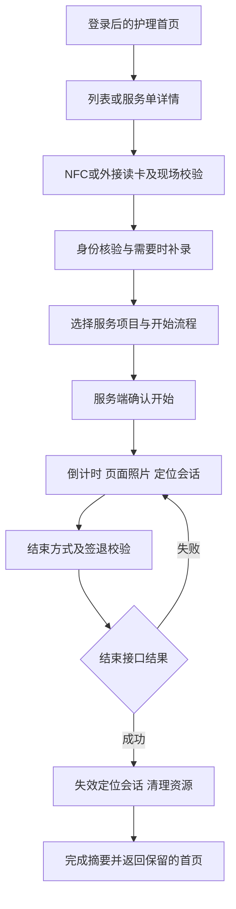
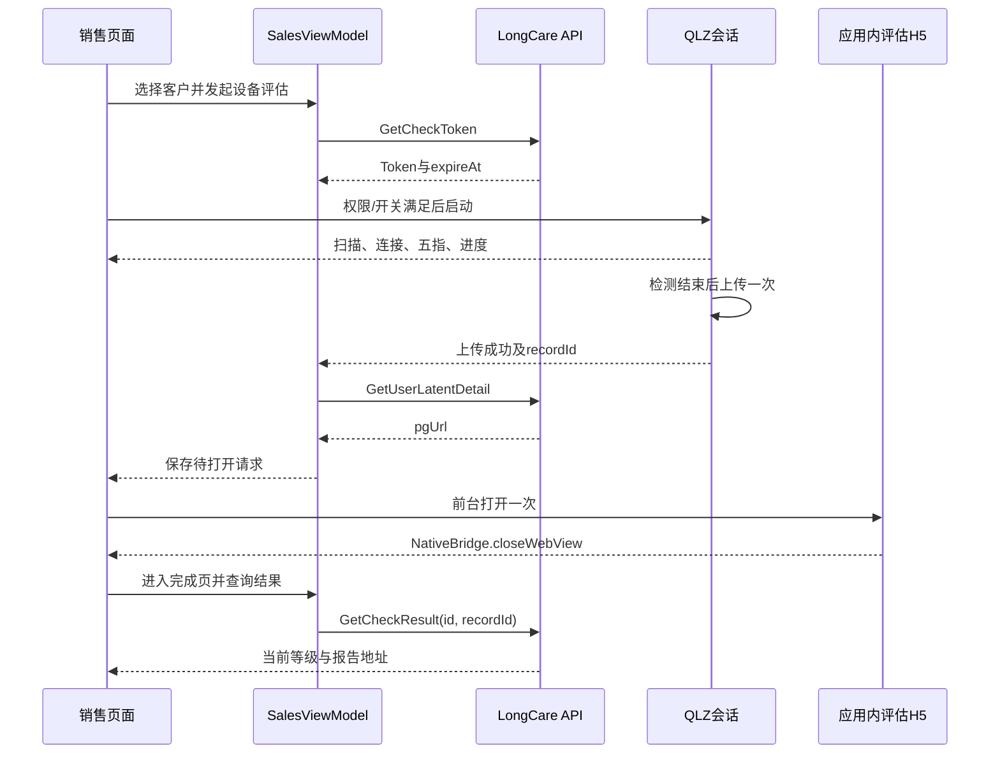

# LongCare 项目整体分析与优化基线

分析日期：2026-09-20。代码基线：`4036a76a`，工作树在本轮开始时无未提交改动。本文面向后续产品、架构、质量和交付优化；不是一次性构建日志，也不替代各领域的当前契约。

> 本文已按当前单应用形态更新：独立助手和双包发布已退役，本地 NFC/R65C 检测从登录页大 Logo 长按确认进入。统计、测试调用范围与发布说明均按当前代码重新核对；硬件验收仍以真实 tasks 状态为准。

> 后续变更（2026-09-21）：设备评估已改为上传后原生结果页查询 GetCheckResult，再手动查看报告；本基线中的自动 H5、待打开请求及其验收建议不再适用。当前流程以[QLZ 接入说明](../integrations/qlz-sdk.md#sdk-调用链)为准，纯表单保持不变，新流程真机验收尚未执行。

阅读方式：项目负责人先读第 1、3、16、17 章；客户端开发重点读第 4～13 章；测试与发布负责人重点读第 14、15、18 章；文档维护者读第 19 章和[文档治理](../README.md#文档维护规则)。文中的“建议”没有自动转化为已批准的业务变更。

> 配置更新（2026-09-21）：QLZ 已移除测试模式覆盖，保留用户确认的正式 appKey，新授权获取一次性 Token；上传鉴权恢复保留原记录。本基线后文的固定测试 key/test mode 描述为历史状态，不再代表当前配置；厂商弱 TLS、16 KB 等风险仍未修复，正式服务真机验收待完成。

## 目录

1. [整体判断与分析边界](#1-整体判断与分析边界)
2. [项目规模与技术基线](#2-项目规模与技术基线)
3. [产品目标、角色与需求矩阵](#3-产品目标角色与需求矩阵)
4. [护理业务流程与状态边界](#4-护理业务流程与状态边界)
5. [销售与评估业务流程](#5-销售与评估业务流程)
6. [启动、隐私、账号与本地检测](#6-启动隐私账号与本地检测)
7. [模块架构、依赖方向与迁移方案](#7-模块架构依赖方向与迁移方案)
8. [导航、页面与状态恢复](#8-导航页面与状态恢复)
9. [数据、数据库、接口与一致性](#9-数据数据库接口与一致性)
10. [定位、NFC、计时与平台生命周期](#10-定位nfc计时与平台生命周期)
11. [图片、人脸与文件生命周期](#11-图片人脸与文件生命周期)
12. [QLZ、WebView 与厂商边界](#12-qlzwebview-与厂商边界)
13. [性能、自适应与可维护性](#13-性能自适应与可维护性)
14. [测试结构与质量证据](#14-测试结构与质量证据)
15. [构建、签名、发布与运维](#15-构建签名发布与运维)
16. [风险与优化事项登记](#16-风险与优化事项登记)
17. [分阶段技术方案与实施顺序](#17-分阶段技术方案与实施顺序)
18. [验收矩阵、指标与待确认需求](#18-验收矩阵指标与待确认需求)
19. [文档一致性与维护制度](#19-文档一致性与维护制度)
20. [证据索引与本轮验证边界](#20-证据索引与本轮验证边界)

## 1. 整体判断与分析边界

### 1.1 项目目前处于什么阶段

LongCare 已有护理执行、销售客户评估以及本地读卡检测的主要实现。它不是只具备页面原型的项目，也不是完成全部模块化和全部设备验收的成熟终态。更准确的定位是：**业务主链路已有实现、工程约束较完整，但平台资源生命周期、数据升级、端到端验收和维护责任仍需要收敛的 Android 工程**。

当前最值得保留的基础包括：纯 Kotlin 的 Model/Domain 边界、Feature 不直接依赖 Data、本地检测与业务提交隔离、可保存 Navigation 3 栈、会话失效统一处理、定位会话隔离、图片处理统一策略、厂商适配器与可注入测试，以及签名/组件/发布检查。优化应建立在这些已有能力上，不应把它们作为“大重构”一并替换。

当前主要矛盾不在于技术栈老旧。仓库已经采用 Navigation 3、Compose、现代 AGP/Kotlin、Room、WorkManager 与 CameraX。真正影响后续效率的是：需求、运行实现、测试执行范围和文档状态之间仍有偏差。例如文档曾把 Room 说成显式迁移，实际却在缺少迁移路径时重建；一些文档仍禁止生产发布，实际 Release 已对指定风险改为告警；已有测试文件并不保证日常脚本会运行它们。

### 1.2 优先结论

| 判断 | 证据 | 对优化的含义 |
|---|---|---|
| 产品两条主线应分别管理，但复用会话、相机、图片等基础能力 | 护理流程与 Home 内销售状态机并存 | 不用一个庞大通用工作流框架强行统一两条业务 |
| `:app` 仍承担大量业务代码 | 主源集约 29,175 行，占本次统计约 50.7% | 模块化必须围绕可独立验收的功能切片，而不是仅移动文件 |
| 数据升级策略是实际决策缺口 | `DatabaseModule` 与重建测试 | 下一次 schema 变化前明确本地数据是否可丢弃 |
| 质量脚本数量较多，执行覆盖并不等同于业务覆盖 | 普通 CI 无 App 全量单测；full 无 home/location 单测 | 建立“需求 → 测试 → 执行入口 → 证据”的映射 |
| QLZ 主路径与异常矩阵的完成状态不同 | 历史主路径验收说明与任务 5.3 未勾选并存 | 不把成功测量一次扩展成完整硬件验收 |
| 性能基础设施存在，测量语义尚未充分成立 | Profile 生成器仅等待包根节点、滑动与返回 | 先修正旅程和指标，再讨论性能收益 |
| 厂商风险仍存在 | 固定 QLZ 配置、弱 TLS、腾讯 native/consumer rules | 保留风险接受边界；新版本、新风险须重新评估 |
| 文档需要分清现状、契约、提案和历史 | 根文档、专项文档、OpenSpec 有重复事实 | 一个事实指定主文档，其他文档摘要引用 |

### 1.3 本次分析能证明什么

本次读取并交叉核对了构建配置、源码关键路径、Manifest、数据库实体与测试、导航、销售/QLZ 状态处理、质量脚本、工作流、当前文档、主规格及活动 change。前次分析使用 Android CLI 与官方知识库核对了构建结构和 API 37 大屏行为；本轮依据当前 Gradle/源码复核，不把旧 CLI 助手变体输出当作当前模块证据。

证据用以下四类理解：

- **当前实现事实**：本次可以从源码或配置直接定位。例如数据库版本、发布任务、接口分支。
- **历史验收记录**：仓库文档或 change 记载曾通过，但本轮没有重跑。例如某次真实 BLE 完整检测。
- **风险推断**：从实现约束推出可能影响，需要实验确认。例如重建表可能失去待上传照片索引。
- **优化建议**：拟议方案、指标或责任分配，尚未作为当前产品承诺。

本次没有重新执行真实登录、短信、人脸上传、客户新增、问卷提交、BLE 检测、正式发布或全量设备测试。没有取得服务端代码、生产监控、业务量、崩溃率、真实 SLA、市场新审核结果。不能据此宣称系统已生产验收、不存在安全问题、符合全部市场政策或已实现性能提升。

## 2. 项目规模与技术基线

### 2.1 可复现的规模快照

统计口径：基线 Git 跟踪文件中，各模块 `src/main`、`src/test`、`src/androidTest` 下的 `.kt` / `.java` 文件；行数含空行和注释，不含生成构建文件、XML、资源、AAR、build-logic，也不含 `debug`、共享测试或特殊 Release 测试源集。因此下表不是覆盖率或复杂度评分。

| 模块 | main 文件 | main 行数 | test 文件 | androidTest 文件 |
|---|---:|---:|---:|---:|
| app | 257 | 29,175 | 109 | 28 |
| core:model | 55 | 2,415 | 0 | 0 |
| core:domain | 21 | 622 | 0 | 0 |
| core:data | 56 | 4,786 | 15 | 2 |
| core:common | 50 | 5,021 | 4 | 0 |
| core:ui | 13 | 1,341 | 1 | 0 |
| feature:login | 4 | 273 | 0 | 0 |
| feature:home | 4 | 116 | 1 | 0 |
| feature:identification | 80 | 7,717 | 19 | 0 |
| feature:location | 16 | 1,954 | 6 | 0 |
| feature:photoupload | 24 | 2,277 | 2 | 1 |
| feature:servicecountdown | 10 | 660 | 0 | 0 |
| feature:carddiagnostics | 4 | 521 | 3 | 0 |
| integration:txface | 4 | 458 | 2 | 0 |
| baselineprofile | 2 | 160 | 0 | 0 |
| **合计** | **600** | **57,496** | **162** | **31** |

另外两个 `integration:txface-live` / `integration:txface-normal` 是本地 AAR artifact wrapper，没有上述 main 源码。主构建共 17 个 Gradle 模块，`build-logic` 是独立 included build。

不能由“某模块 test 文件为 0”直接判断功能没测试：LoginViewModel、倒计时及部分定位测试仍放在 App 测试源集中。应同时检查测试所属模块和实际被测代码。反过来，定位模块有 6 个 test 文件，却未列入 full 的显式测试任务，这是另一类问题。

### 2.2 技术基线与版本事实来源

本次版本为 `1.0.6 (62)`；`compileSdk=37`、`targetSdk=36`、`minSdk=24`、JDK 21。工具链为 Gradle 9.7.1、AGP 9.4.1、Kotlin 2.4.20、KSP 2.3.12。

UI 为 Compose BOM 2026.09.00、Material 3、Navigation 3 1.1.7；持久化为 Room 2.8.5、DataStore 1.2.1；后台任务为 WorkManager 2.11.2；网络为 Retrofit 3.0.0、OkHttp 5.5.0；CameraX 为 1.6.2；ML Kit 人脸检测为 16.1.7。QLZ 为本地 1.3.0.5 Lite AAR，腾讯人脸 Live 6.6.2/Normal 5.1.10。

这些是仓库配置值，不是对互联网“最新版本”的宣称。版本更新后应以 [constants](../../constants.gradle.kts)、[version catalog](../../gradle/libs.versions.toml) 和[技术栈](../architecture/tech-stack.md)为准，本文快照不得反过来限制升级。

### 2.3 对技术栈的总体判断

当前没有证据支持以“统一技术”为由替换 Compose、Navigation 3、Hilt 或 Room。核心抽象方向基本清晰。更实际的成本来自三方面：平台资源存在跨页面生命周期；本地状态与服务端状态权威不同；AAR 是不可由应用完全控制的二进制依赖。

Moshi、kotlinx.serialization、部分 Gson/Protobuf 同时存在也不能仅凭数量判为重复。它们可能承担 HTTP DTO、路由保存、厂商协议或间接依赖的不同职责。精简前应识别各自真实调用与 R8 保留原因，验证序列化兼容性，不直接删掉名称相近的库。

## 3. 产品目标、角色与需求矩阵

### 3.1 产品边界

护理端的目标是完成一次可追溯的服务执行：确认服务对象和执行人、验证现场条件、记录护理内容、留存照片和位置、计时、提交结束结果。销售端的目标是管理客户并完成登记、设备/表单评估和报告查看。本地读卡检测用于排查 NFC/R65C 输入，不承担业务提交，不扩展为通用测试平台。

客户端不是护理服务或评估结果的最终权威。订单状态、人脸比对结果、评估等级、可访问报告地址和账号身份均由后端响应决定。客户端负责及时、可靠、可恢复地呈现与提交，不应自行推导服务完成或评估等级。

### 3.2 用户角色及职责

| 角色 | 入口/识别 | 核心目标 | 产品和权限边界 |
|---|---|---|---|
| 护理执行人员 | 普通账号 Home | 执行服务单、身份核验、留痕和签退 | UI 可见性不代替后端订单权限 |
| 销售顾问 | `userIdentity == 2` | 客户、待办、登记和评估 | 客户与评估请求必须绑定当前选择对象 |
| 内部排障人员 | 登录页中央大 Logo 长按并确认 | NFC/R65C 本地读取、显示和复制 | 隐私同意后可用；不独立登录，不签到或上传 |
| 运营/项目人员 | 消费服务端记录，未发现独立移动端管理入口 | 审核、排障、交付 | 不能把业务参与角色写成客户端已有管理功能 |
| 产品/服务端/厂商 | 开发与运行协作 | 定义流程和异常处理 | 等级、Token、SDK 配置、设备语义需跨方确认 |

### 3.3 需求基线及可观察验收

下表由当前实现和既有规格提炼，供后续优化保持行为使用；不是补建一套平行 OpenSpec。

| 编号 | 需求 | 当前状态 | 必须保留的验收点 |
|---|---|---|---|
| REQ-01 | 首次隐私选择 | 已有实现 | 拒绝退出；网页关闭不代表同意 |
| REQ-02 | 手机验证码登录 | 已有实现 | 协议默认未选；发送与登录分别受同意门禁约束 |
| REQ-03 | 持久会话及失效处理 | 已有实现 | 持久写入完成后切状态；重复失效不重复弹出 |
| REQ-04 | 按身份分流 | 已有实现 | 销售/护理体验匹配当前账号；换号不恢复旧栈 |
| REQ-05 | 服务单列表与详情 | 已有实现 | 订单/计划标识正确，不展示另一服务单缓存 |
| REQ-06 | 开始服务前校验 | 已有实现 | NFC/读卡、现场位置和接口结果决定下一步 |
| REQ-07 | 服务人员人脸核验 | 已有实现 | 完整眨眼采集；服务端比对拒绝不能显示通过 |
| REQ-08 | 缺失登记照补录 | 已有实现 | 走补录及兼容路径，清理旧文件；失败可恢复 |
| REQ-09 | 服务项目选择 | 已有实现 | 选择集合与服务单一致，恢复后不串单 |
| REQ-10 | 业务照片留存 | 已有实现 | 应用内相机、方向、水印、压缩、数量限制 |
| REQ-11 | 服务进行中持续定位 | 已有实现 | 只在有效订单会话；不落库、不离线补传 |
| REQ-12 | 倒计时与提醒 | 已有实现 | 归零只是提醒，不能代替业务结束成功 |
| REQ-13 | 服务结束与摘要 | 已有实现 | 结束成功立即停定位并清理中间导航；失败保留会话 |
| REQ-14 | 用户与服务记录 | 已有实现 | 已/未服务列表、个人记录与账号隔离 |
| REQ-15 | 客户搜索与待办 | 已有实现 | 请求迟到不能覆盖新查询/新客户 |
| REQ-16 | 客户登记 | 已有实现 | 最多三张相机照片；失败保留，放弃/成功清理 |
| REQ-17 | 表单评估 | 已有实现 | 用服务端 pgUrl；关闭后重新获取纯表单结果 |
| REQ-18 | QLZ 设备评估 | 已有实现；完整异常真机验收未闭合 | 扫描有界、单租约、去重上传、退出释放 |
| REQ-19 | 上传后进入 H5 | 已有实现 | 上传成功才打开一次；100% 采样不能提前完成 |
| REQ-20 | 评估等级与报告 | 已有实现 | 有设备记录/无设备记录分支明确，不伪造等级 |
| REQ-21 | 应用内更新 | 已有实现 | 下载/校验/安装授权有明确状态，重建可恢复 |
| REQ-22 | 本地读卡检测 | 入口已有真机确认；真实读卡验收未闭合 | 长按确认、无震动；模式独占，后台/退出释放，无业务副作用 |
| REQ-23 | 单应用交付 | 已有实现 | 主 APK/AAB 和校验和完整、身份正确；不生成新助手包 |
| REQ-24 | 大屏及旋转 | 局部适配；仍有缺口 | 顶层导航适配不等于相机/表单/状态全部适配 |

### 3.4 非功能需求应如何补齐

仓库已有技术约束，但未发现可由生产数据证明的业务 SLO。后续应给“可靠”“快”“省电”定义具体观测点，而非直接承诺一个任意数字。

- 可靠性：按请求阶段区分成功、用户取消、权限拒绝、网络失败、SDK 错误和后端拒绝。
- 恢复能力：分别定义旋转、进程死亡、换号、重启和任务移除，不使用笼统“支持恢复”。
- 性能：分别测首次隐私启动、已同意未登录启动、已登录护理/销售启动，以及拍照到可用图片的耗时。
- 隐私：明确每项数据的采集入口、存储、上报、清理和授权时机；不把用户同意当作无限采集许可。
- 可维护性：定义稳定公共契约、模块归属、测试执行入口与文档 owner。
- 兼容性：区分 API、ABI、16 KB 设备、相机/NFC/BLE 硬件和窗口形态。

## 4. 护理业务流程与状态边界

### 4.1 流程视图



这是业务概念图；实际页面入口可由订单状态跳转，不能将图中顺序当成所有订单必须固定点击同一组页面。真实路由见[页面地图](../architecture/ui-and-screen-map.md)，开始/结束编排见 NFC workflow 的 operations、executor 和 result handlers。

### 4.2 最重要的状态区分

护理链路至少有四组不能混为一谈的状态：服务端服务单状态、Room 本地执行/项目状态、页面导航状态、Android Service/提醒状态。

例如倒计时结束后，页面可能展示结束入口，但服务端尚未接受结束。此时结束定位会造成留痕缺口；因此现有规则以结束接口成功为停止依据。反过来，结束接口成功但页面尚未返回时，定位必须先失效并取消在途协程，不能等待用户点击完成才停止。

另一个例子是任务移除：持续定位按现有规则停止且不自动恢复，但提醒可能由独立持久状态在设备重启后恢复。二者服务的业务目的不同，不能把“开机恢复提醒”改写成“开机恢复订单定位”。

### 4.3 数据和行为不变量

1. 身份结果、图片、选择项目与 NFC 回调必须绑定当前订单，不能仅绑定页面类型。
2. 请求失败不能默认推进服务状态；成功回调也不能影响已经换号或离开的页面。
3. 服务单结束成功必须触发一次有效清理；重复成功响应和重复点击不应重复上传或继续弹栈。
4. 已发送的网络请求无法被客户端真正撤回，后端仍须校验服务单状态和用户权限。
5. 用户照片数量上限来自系统配置；客户端的回退策略与后端上限应明确一致。
6. 开始、结束和上传属于有副作用接口，优化重试策略前需确认后端幂等契约。

### 4.4 后续优化方案

优先把“业务结果 → 清理 → 导航”的顺序做成稳定测试契约，而不是先迁移全部页面。第一步选取结束服务这一条高价值路径：构造成功、失败、超时、重复点击、换号和迟到响应；断言 ServiceOrderLifecycle 的通知顺序、资源释放和 Home 栈保留。测试固定后，再将 route UI 下沉到 Feature。

对于接口超时，应区分“服务器未执行”和“服务器已执行但响应丢失”。当前仓库不足以证明后端对每个副作用请求的幂等保证，不能擅自增加统一自动重试。应由服务端给出可查询结果、请求幂等键或明确重复调用规则，然后客户端再实现对应恢复路径。

## 5. 销售与评估业务流程

### 5.1 客户登记和检索

销售体验目前位于 HomeRoute 内。`SalesViewModel` 同时处理最近客户、待办、搜索、详情、登记、定位、照片上传、评估 Token、结果查询和恢复状态；`SalesExperienceScreen` 协调页面与原生能力。

登记照片最多三张；照片提交使用 COS 对象 key，与临时本地 URI 不同。删除、替换、放弃或提交成功后释放受管文件，失败保留重试。优化时应分别测试“客户接口失败”和“照片上传成功后客户接口失败”，后一种情形还涉及服务端对象回收策略，当前不能推断已由后端自动清理。

列表和详情使用当前查询/客户身份控制异步结果。拆分 ViewModel 时要保留这些绑定，不能让上一客户的迟到详情覆盖新客户，也不能将上一次评估的等级作为新评估的默认值。

### 5.2 设备评估主路径



关键业务判断：**100% 采样、SDK 上传成功、H5 主动关闭、结果接口返回，是四个不同阶段**。不能把任意一个成功回调泛化成全部业务完成。

### 5.3 纯表单分支

纯表单使用客户接口返回的 `pgUrl` 打开 H5；关闭后重新请求 `GetUserLatentDetail` 获取当前 `pgResult`/`pgUrl`。有设备记录才调用 `GetCheckResult`。此分支来自已记录的真实接口差异：没有设备 recordId 时，GetCheckResult 不能按 Swagger 可空说明简单调用。

优化方案必须保持：不读取缓存旧等级、不在失败后切换接口兜底、不自行计算等级、不要求 H5 新增结果协议。若未来服务端统一契约，需要单独变更并更新主规格和契约测试。

### 5.4 关闭语义与业务完成

评估 H5 主动调用关闭方法，按当前产品约定进入原生完成页；系统返回只回到评估入口。报告、协议和隐私页面调用同一方法只关闭自身。H5 成功弹窗确认可能仅刷新网页，不应由客户端注入脚本替它关闭。

这意味着“原生完成页已展示”不是独立证明后端问卷已持久化成功的证据。客户端随后请求结果，失败或字段为空时显示待同步/错误并允许刷新。后续若需要更强完成凭据，应由产品和服务端定义新契约，不能在一次性能或模块重构中隐式加入二次确认。

### 5.5 恢复和异常要求

| 异常 | 当前约定 | 优化验证重点 |
|---|---|---|
| Token 过期 | 最多恢复一次，第二次终止 | 旧 Token 回调不可覆盖新会话 |
| 未发现设备 | 有界扫描结束，用户可重扫 | 重扫不叠加监听器 |
| 蓝牙/权限/定位开关缺失 | 阻断并提供恢复操作 | 设置返回后重查，而非相信旧 UI 标志 |
| 设备上传失败 | 本次内存数据重试 | 不重测、不并发提交；进程死亡不伪造续传 |
| 上传后 pgUrl 获取失败 | 只重查客户详情 | 不再上传、不先进入业务成功 |
| H5 加载失败 | 原生错误与返回可用 | 重组不循环重载 |
| 查询等级失败 | 重试同一分支接口 | 不以旧结果或 A 级替代 |
| 评估页退出/销毁 | 先使 generation 失效再释放 | stopScan 同步回调也不能重新导航 |

## 6. 启动、隐私、账号与本地检测

### 6.1 启动链路

`MainApplication` 初始化日志、启动会话相关定位观察；已同意隐私时才调用后置初始化，Release 的 Bugly 与启动更新任务在该边界之后执行。`MainApp` 未同意时只呈现隐私弹窗；会话为 Unknown 时展示启动状态，LoggedOut 进入登录，LoggedIn 进入 Home。

应避免过度概括为“隐私同意前绝无任何初始化/网络”。Application、依赖注入、ContentProvider、系统配置和 WebView 都有独立初始化路径；需要用合并 Manifest、实际 SDK 清单与隐私专项测试证明。应直接核对当前主应用的合并 provider 时序；已删除助手的配置不能作为主应用证据。

### 6.2 会话模型

`DefaultUserSessionRepository` 将用户数据编码存入 DataStore；会话 StateFlow eager 启动，既被 UI 使用，也被接收器/拦截器等非 UI 消费。登录与退出是 suspend 写入，不应在写入完成前对外宣布状态已经持久改变。读取错误或用户数据损坏会进入登出状态。

全局失效处理以当前用户与 token 作为去重依据，持久清理后发出可消费失效状态。建议测试存储写入失败时用户提示与后续请求的行为，而不是仅断言正常退出。这里的建议是恢复体验核验，不是本轮发现已发生线上错误。

### 6.3 账号隔离要检查四层

- 导航：当前实现用 session identity 重置保存栈，防止旧账号页面恢复。
- 进程缓存：订单详情、厂商临时凭据、图片展示 URL 等是否随换号失效，需要逐一追踪。
- 本地持久数据：Room 订单实体主要以 orderId 建键，没有在这些实体中显式加入账号字段；这要求退出清理或服务端数据访问保证明确。
- 远端会话：客户端账号隔离不代表服务端允许同一账号多设备并行，需明确踢出和 Token 失效契约。

本次可确认导航和定位有账号边界；未完成全缓存/全表在换号情况下的动态验证，不能直接断言存在越权泄漏，也不能断言全链路隔离已经证明。后续增加“账号 A 数据 → 退出 → 账号 B → 旧响应到达”的集成场景，比继续增加普通登录成功测试价值更高。

### 6.4 本地读卡检测的产品边界

全局隐私同意后，登录页中央大 Logo 长按弹出“打开助手”确认框；普通点击不触发，长按没有震动及按压视觉效果。取消和返回不导航；确认后进入 `CardDiagnosticsRoute`，返回保留登录表单。未完成长按和确认状态不跨后台恢复。

`:feature:carddiagnostics` 仅提供 NFC/R65C 本地读取展示、复制/清空和 HID 状态。App 持有 NFC Reader Mode，只有对应页面前台监听，模式切换、后台或退出释放；不向业务事件总线派发、不调用 Repository 签到或上传。没有独立 Application、登录、上传或测试 Launcher。

独立助手和其他测试入口已退役，历史安装包保持原状。默认人脸、相机与正式业务仍使用的共享实现继续保留，但不能据此恢复旧验证菜单。

长按入口已由用户确认真机验收；真实 NFC 标签和 R65C 的两种模式、复制/清空、切换与业务隔离仍见[任务 4.3](../../openspec/changes/integrate-card-diagnostics-in-app/tasks.md)。本地 UID 读取成功只能证明设备输入，不能代替正式服务单签到/签退验收。

## 7. 模块架构、依赖方向与迁移方案

### 7.1 当前职责分布

| 层 | 应保留的职责 | 当前现实 | 优化方向 |
|---|---|---|---|
| App | 启动、根导航、DI/Manifest、平台与厂商组装 | 同时拥有大量护理/销售 route UI | 保留组装，按完整功能切片下沉 |
| CardDiagnostics | 本地读卡 UI/HID 状态 | Feature 仅依赖 Common，NFC 平台监听由 App 提供 | 保持无业务提交边界和页面资源隔离 |
| Model | 共享模型和值对象 | 纯 JVM，部分序列化模型共享 | 明确模型用途，不强求所有 DTO 立即搬迁 |
| Domain | Repository/网关契约和领域规则 | 纯 JVM，约 622 行 | 稳定业务契约，避免引入 Android 类型 |
| Data | API、Room、DataStore、COS 实现和绑定 | 数据访问较集中 | 强化事务、账户与升级语义 |
| Common | 跨业务 Android 基础能力 | 图片、日志、配置、加密、兼容工具较多 | 防止单业务 helper 继续汇入 |
| UI | 通用 Compose 组件及共享 UI 支撑 | 含主题、预览、共享 ViewModel | 共享范围必须有真实消费方依据 |
| Feature | 业务状态、UI、用例及平台抽象 | 身份/照片迁移较多，登录/首页较少 | 以行为与测试边界完成所有权迁移 |
| Integration | 厂商 adapter、依赖和 consumer rules | 腾讯已独立，QLZ 仍 app-owned | 先稳定契约，再评估独立模块收益 |

依赖白名单是[模块依赖规则](../../scripts/quality/module_dependency_allowlist.txt)。允许 App 依赖 Data 是为组装和存量实现服务，不能据此鼓励新 Feature 直接访问数据库。Domain 保持 Android-free 是已有有效约束，无需为模块化再次造一个更深抽象层。

### 7.2 为什么不能按目录数量评价模块化

`feature:home` 的 main 只有 116 行，`feature:login` 273 行，说明它们更多承接状态、动作和入口，尚不拥有完整 route UI。`feature:identification` 已有 7,717 行及主要采集页面，但主身份页仍在 App。这些都是过渡状态，不能在文档中统一写成“所有功能已独立”。

约一半统计源码在 App，并不自动意味着性能差；模块边界主要影响修改范围、编译隔离、测试所有权与协作成本。反之，把文件搬到新模块但继续暴露 App 实现或共享超大状态，并没有改善这些问题。

### 7.3 候选迁移顺序

1. **身份 route UI**：已有 Feature 状态和用例，迁移剩余页面较容易形成闭合切片。先固定默认核验结果、补录和长者照片的返回语义。
2. **登录/首页入口**：体量可能不大，但涉及隐私、角色分流、Home 共享 ViewModel owner 和应用根栈，风险不能只按行数判断。
3. **照片与倒计时 UI**：保持相机、Service、通知、闹钟由平台网关执行，不能为了“独立”把 Activity 持有转移进 ViewModel。
4. **销售能力**：先拆状态责任与测试，再创建独立 Feature。其 UI、客户、登记、评估和导航耦合较大，应避免一次性迁移整个目录。

每次只改变一个所有权切片，保持 route key、参数、结果 key、服务端协议和 UI 行为。迁移完成标准应包含 App 调用依赖减少、Feature 公共 API 收敛、旧实现移除及回归通过，不能只统计搬走行数。

### 7.4 SalesViewModel 的拆分建议

目前 `SalesViewModel` 1,152 行，`SalesExperienceScreen` 847 行，另外多个销售页面文件在 600～800 行。行数只是提示，真正的拆分依据是异步责任与状态生命周期不同。

建议先拆出三类协调职责：客户列表/详情查询、登记与照片提交、评估 Token/H5/结果流程。外层仍负责 Home owner 与销售导航连接。各职责使用明确输入和不可变状态，避免新增一个全局事件总线把耦合隐藏起来。

必须先保留这些回归：搜索结果迟到、客户切换、登记照片删除、重复提交、Token 一次恢复、上传后 H5 单次打开、纯表单分支、结果请求取消。没有这些基线就拆文件，容易得到“更短但更难追踪”的代码。

### 7.5 公共 API 与代码规模

`internal`、`implementation`、领域接口和 dependency allowlist 已在发挥作用。下一步应核查每个公开类型是否确有跨模块使用，而非批量改可见性。特别是序列化、反射、Hilt、JNI 和厂商回调入口，需要生成代码和 Release 回归共同判断。

Common 中 `CryptoUtils` 878 行、`DeviceCompatibilityHelper` 552 行也值得建立责任边界，但本次未做逐算法密码学审计，不能仅凭文件体量宣称存在安全漏洞。先确认哪些能力在正式路径被调用、哪些仅为兼容，再选择独立可验证的清理范围。

## 8. 导航、页面与状态恢复

### 8.1 Navigation 3 的现有实现

根导航采用可序列化路由、`AppNavEntry` 唯一 ID、可保存单栈和 NavDisplay。相同参数的两个页面仍有独立 entry 身份。`NavigationResults` 为调用者 entry 定向存储结果，并与返回栈保存；消费后清空 StateFlow。

Home、服务计划、服务记录，以及特定评估网页通过明确 home owner 共享相关 ViewModel。退出/换号会重置旧作用域。服务完成删除中间执行页面而保留 Home。以上机制已存在，本轮不建议再做导航框架迁移。

### 8.2 两套导航层次

应用级路由承载服务流程、相机、WebView 等跨模块入口；销售 Home 内部以 `SalesNavigationState` 管理客户和评估页面。两层同时存在有实际原因：相机/WebView 是全局能力，销售子页面共享 Home 生命周期。

问题不是“两层必然错误”，而是调用与恢复边界要明确。例如打开 Camera 需要把照片结果送回当前登记；打开评估 H5 需要绑定 Home 的 SalesViewModel，但不通过网页结果邮箱传等级。将所有销售页面机械改成 NavKey 可能改变 ViewModel 生命周期，应单独评估，不顺带塞进拆 ViewModel 工作。

### 8.3 恢复能力矩阵

| 状态 | 当前保存方式或策略 | 能承诺的范围 | 不能推导的能力 |
|---|---|---|---|
| 登录状态 | DataStore | 进程重建可读取 | 后端 token 一直有效 |
| 根路由、entry ID | Navigation 3 保存栈 | 系统保存恢复范围内恢复 | 换账号后继续旧业务 |
| 页面结果 | 可保存 entry 邮箱 | 未消费结果随栈恢复 | 来源已经移除后仍接收 |
| 客户详情 | 保存客户 ID 后重查 | 恢复目标身份与查询 | 完整详情永久离线可用 |
| 待打开评估 H5 | SavedStateHandle 请求与消费状态 | 前台恢复后一次导航 | 厂商连接对象持久恢复 |
| QLZ 连接/上传失败对象 | 当前 UI 会话内存 | 同会话受控重试 | 进程死亡后自动续检/续传 |
| 持续定位 | 进程订单会话 | 进入订单后重新确认再启动 | 重启后自动恢复 |
| 更新任务 | WorkManager 与 work ID | 调度/观察恢复 | 任意网络中断都有字节级断点续传 |
| 照片 | 受管文件及状态引用 | 文件仍有效时继续使用 | 任意本地引用都已上传或可长期访问 |

SavedStateHandle 不是通用数据库，不能保存大图片、BluetoothDevice、Activity 或厂商可变对象。优化应保留轻量标识，在恢复时查询或重新获取真正资源。

### 8.4 高价值导航回归

应优先测试同类型重复页面返回、来源页移除后迟到结果、旋转时未消费结果、换号后恢复、服务完成后系统返回、评估 JS 返回与系统返回分歧，以及外层 Camera/WebView 覆盖销售页面时内部状态是否保留。

对于 registry，目前 login/home/identification 三个 feature entry 常量只是部分入口注册，不能把注册数当成页面完整性指标。文档的完整路由清单与代码路由应独立核对。

## 9. 数据、数据库、接口与一致性

### 9.1 网络架构

LongCare API 使用 Retrofit + Moshi、自定义 ApiResult adapter、请求加密/设备信息拦截器和响应处理器。主 OkHttp 配置 30 秒连接/读/写超时及 10 MB HTTP 缓存；Debug 日志为 BASIC，Release 为 NONE。腾讯人脸使用独立 Retrofit/OkHttp 配置。

这些机制能统一传输行为，但不能代替每个接口的业务幂等与权限校验。HTTP 缓存、内存订单缓存、Room 缓存、页面 StateFlow 都可能同时存在，需要定义哪个字段何时过期、换号时何时清理、强制刷新绕过哪些层。

### 9.2 接口分组与易错契约

| 分组 | 代表接口 | 需要保持的约定 |
|---|---|---|
| 启动/登录 | `/V1/System/Start`、`/V1/Phone/SendSmsCode`、`/V1/Login/Phone` | 协议门禁、会话写入和隐私边界 |
| 服务单查询 | `TodayOrder`、`OrderList`、`InOrder`、`OrderInfo`、`OrderState` | 列表/详情/状态职责不同，不能互相当作缓存权威 |
| 执行 | `CheckOrder`、`StarOrder`、`CheckEndOrder`、`EndOrder` | 现有拼写是接口契约，不能作为拼写优化修改 |
| 定位 | `/V1/Service/AddPostion` | 拼写保持；上传失败不推导服务单状态 |
| 人脸 | `GetFace`、`SetFace`、`CheckFace` | 登记状态与本次比对不同，GetFace 禁缓存 |
| 文件 | `UploadToken`、`GetFileUrl` | 对象 key、临时 URL、本地 URI 分开 |
| 销售 | 客户新增/查询/待办、`GetCheckToken`、`GetCheckResult` | 空设备 recordId 分支和新结果获取 |
| 更新 | `/V1/System/ChecVersion` | 路径保持；版本包身份与校验独立验证 |

当前 API 路径不应根据英语习惯修正为 `StartOrder`、`AddPosition` 或 `CheckVersion`。网络契约测试是防止这类“清理”引入线上不兼容的重要保护。

Sale 中 `liveLat/liveLng` 的文档解释与通常命名习惯存在历史差异，客户端按字段名保持现有传递，不自行互换。设备上传参数缺失时使用空值，不复制 Demo 坐标。未来由服务端确认真实含义后再共同修订。

### 9.3 数据库存储模型

Room v3 包含五张业务表：

| 表 | 主要用途 | 对升级策略的影响 |
|---|---|---|
| orders | 服务单基础信息与同步时间 | 多数可从后端重新查询，但仍需恢复入口 |
| order_elder_info | 长者资料与地址 | 包含个人信息，不能当作普通无敏感缓存 |
| order_local_states | 本地开始/结束时间、核验状态、needs_sync | 可能包含尚未由后端完整重建的状态 |
| order_projects | 项目及选择状态 | 当前选择可能是本地交互结果 |
| order_images | 本地 URI/path、上传状态、cloud key/URL、错误 | 尚未上传记录与文件索引需单独评估 |

相关表有外键级联删除和索引；定位没有本地 outbox。这符合当前“不存定位、不补传”的规则，也意味着不能宣称已有完整离线作业系统。

### 9.4 Room 迁移冲突的实际结论

`DatabaseModule` 当前直接调用：

```kotlin
.fallbackToDestructiveMigration(dropAllTables = true)
```

`LongCareDatabaseMigrationTest` 明确验证 v1/v2 升 v3 后删除旧表数据及额外 legacy 表，并验证 v3 普通重开保留数据。当前未配置显式 Migration 链。过去文档中的“必须显式迁移且不允许破坏性 fallback”不能当作已经实现的事实。

Room 官方说明，缺少迁移路径时使用此 fallback 会重建数据库并失去相应数据。因此“迁移测试通过”必须说明测试的是保留还是删除。本项目风险推断是：如果升级时还有待上传图片、本地选择或未同步状态，表重建可能使这些状态或文件关联丢失；是否可从后端恢复、受管文件如何回收，本次没有动态证据证明。[Room 官方迁移说明](https://developer.android.com/training/data-storage/room/migrating-db-versions)

建议在下一次 schema 变化前形成明确决策：

1. 列出每张表/字段是否可由后端完整恢复，区分缓存和本地唯一状态。
2. 对必须保留部分设计显式或适用的自动迁移；对允许重建部分明确用户影响和重新加载机制。
3. 验证数据库重建与外部受管文件之间不会形成无引用文件或丢失未上传照片。
4. 测试真实旧 schema 数据，包括 PENDING/FAILED 上传状态、项目选择和核验状态。
5. 不把本次文档修正理解成已授权删除更多数据，也不在未厘清需求前直接移除 fallback 导致升级崩溃。

### 9.5 缓存、事务与清理

`UnifiedOrderRepository` 既有按 OrderKey 的内存缓存，也通过多个 DAO 同步/读取 Room。这里存在值得专项核验的事务和观察一致性问题：多表读取/更新时 UI 是否会短暂看到组合不完整的数据，取消请求是否部分更新，强制刷新与普通缓存读取是否竞争。

本次没有通过故障注入确认这些问题已经发生，因此列为优化核验项。建议以“同一订单并发刷新”“同步中途取消”“父表删除后文件清理”“换账号后缓存访问”建立测试，再决定需不需要事务边界调整，而不是仅按代码风格增删 `withTransaction`。

### 9.6 数据安全和备份

主 Manifest `allowBackup=true`，但 backup/extraction XML 明确排除 database/sharedpref/file/external。评估时必须读完整规则，不能仅凭单个 allowBackup 属性断言业务数据被云备份。

DataStore 用户对象编码不是“已加密”的证明，私有目录也不代表端到端保密。报告不暴露实际 token、测试 key 或用户信息。后续按实际威胁和市场要求复核持久会话、日志脱敏、截图和临时文件，不凭惯例叠加未经需求确认的安全框架。

## 10. 定位、NFC、计时与平台生命周期

### 10.1 定位控制链路

当前定位分为单次业务定位和订单持续定位。单次定位使用独立客户端，不创建第二个持续 collector。持续定位由业务层确认订单服务中后启动 location 前台 Service，Service 持有采集及唯一 AddPostion 调用点。

`LocationReportingManager` 协调业务状态，不自行上传；`LocationSessionLifecycleObserver` 将退出、失效和换号与停止绑定；会话 generation、owner 和 cancellation gate 隔离旧请求。采样消费使用 conflate，只保留一个最新待处理点，避免网络慢时无限堆积。

### 10.2 运行与停止策略

| 触发 | 当前策略 | 为什么重要 |
|---|---|---|
| 正式开始接口成功 | 可据此确认服务中，再经权限入口启动 | 不因重复状态查询失败阻碍已确认订单 |
| 重新进入订单 | 先重查业务状态 | 不信任旧进程内存 |
| 正常状态同步 | 约 5 秒周期 | 远端结束有同步延迟 |
| 初始状态不确定 | 不启动，按 5/10/20/40/60 秒退避复核 | 不能在未确认前持续采集 |
| 已确认服务中后查询异常 | 保留最后确认状态 | 避免网络抖动造成永久停报 |
| 单点上传失败 | 记录诊断并丢弃，不重试此点 | 明确不是离线补传系统 |
| 结束接口成功 | 失效会话、取消请求、停止 Service | 防止结束后继续采集 |
| 结束接口失败或归零 | 不等同于结束 | 避免遗漏服务中留痕 |
| 退出/换号/任务移除 | 停止且不自动恢复 | 限定会话和隐私边界 |
| 进程/设备重启 | 不恢复旧持续定位 | 没有持久调度或上传队列 |

源码 `START_NOT_STICKY`、`stopWithTask=true` 与非持久会话支持这些边界。进程硬终止未必调用 onDestroy，因此安全性不能只靠“最终会释放”；还依赖没有自动恢复旧任务的调度入口。

### 10.3 位置准确性与耗电的优化方法

目前没有在此分析中采集设备耗电、定位误差或上传延迟。建议先按实际护理场景记录有效点比例、样本年龄、定位就绪时间、上报间隔和失败分类，再决定采样/上报参数。不要仅为减少请求把上传间隔随意加大，也不要为提高成功率新增离线补传，因为后者是产品规则变化。

还应确认远端状态检查 5 秒周期是否满足业务成本与时效要求，以及弱网下保留最后服务中状态的最长可接受时间。此类调整涉及服务端与隐私目的，应作为单独需求讨论。

### 10.4 NFC 与 R65C

正式业务使用 NFC workflow，R65C HID 是无原生 NFC 等场景的兼容路径；本地检测的读卡显示与复制属于独立于业务提交的 UI。当前已移除无入口的设备选择页，不能依据旧文档再次添加一个中间设备选择路由。

高价值回归包括：标签读取重复、UID 格式、外接键盘输入与普通按键区别、输入超时、设置返回后前台分发恢复、后台停止捕获、离页后迟到结果、开始/结束两种模式不串用。模拟器或合成 Intent 可验证处理逻辑，不能证明真实贴卡和 R65C 固件行为。

### 10.5 倒计时、闹钟与通知

倒计时前台服务为 specialUse，响铃服务为 mediaPlayback，定位服务为 location，各自目的和权限不同。精确闹钟、通知权限、全屏提醒和开机恢复也不是一个开关。

建议把以下状态组合纳入测试：通知拒绝但计时仍正确、精确闹钟未授权时的产品降级、重复闹钟/关闭响铃广播、锁屏与前后台、设备重启后会话和隐私门禁、取消服务后旧提醒不再唤起。当前没有把系统广播的所有实际 ROM 差异重新验收，报告不能用 Manifest 声明代替运行证据。

## 11. 图片、人脸与文件生命周期

### 11.1 统一图片管线

标准业务照片走 CameraRoute 和 `UnifiedImagePipeline`，包含方向修正、水印、JPEG 压缩、受管目录、原子写入与大小检查；策略集中在 `ImageProcessingPolicies`。这已经是合理的复用点，应避免 Feature 迁移时复制一份图片工具。

当前水印策略短边 1080，JPEG 初始质量 90、最低 70；人脸比对策略限制解码图片 500,000 字节，初始质量 90、最低 55。照片最大值由对应常量/策略控制。以上是源码当前值，后续应以管线和策略测试为准，不从文档硬编码第二份参数。

### 11.2 文件必须有明确所有者

一张图片可能依次处于：相机临时输出、受管业务文件、登记/订单状态引用、上传队列、COS 对象、可访问 URL。每个阶段的所有权转换都应明确，尤其是相机返回成功但来源页已消失、上传成功但业务提交失败、删除图片时上传仍进行、数据库重建后文件仍存在。

目前标准水印照片可能存放在应用专属外部 Pictures 子目录，手动采集在私有目录；不能把“受管”误写成所有照片都存同一种路径。生命周期治理的关键是引用可追踪、释放只针对本流程文件、失败保留重试，而不是全盘扫描删除所有图片。

### 11.3 默认人脸链路

默认服务人员核验使用 CameraX/ML Kit 检测单人、姿态和眼睛状态，建立睁眼基线，经闭眼与稳定睁开后采集，再由服务端 CheckFace 判断是否通过。登记照状态查询与实际人脸比对不同；前者决定是否补录，后者决定本次服务人员验证是否成功。

ML Kit 的眨眼/姿态检测是采集门槛，不能写成达到某一认证等级的反欺诈保证。备用腾讯共享实现仍保留，独立测试入口已删除，不能因为保留腾讯集成就把它描述为默认订单核验路径。

### 11.4 优化和验收重点

| 层次 | 应测行为 | 为什么不是简单页面测试 |
|---|---|---|
| 帧分析 | 限制并行帧、分析失败释放、稳定状态发布 | 卡帧会影响实时采集和内存 |
| 相机生命周期 | 权限拒绝、设置恢复、旋转、离页释放 | ViewModel 正常不代表 CameraX 资源正常 |
| 眨眼状态 | 顺序、姿态失效、多人、光线变化 | 单次检测眼睛关闭不等于完整眨眼 |
| 编码 | 尺寸、EXIF、字节上限、失败提示 | API 接收大小与 Base64 字符长度不同 |
| 上传 | 取消、重试、凭据过期、业务提交失败 | 网络成功不等于订单记录成功 |
| 回收 | 替换、删除、放弃、成功及迟到回调 | 直接删文件可能破坏仍在用的引用 |

性能实验应分别测相机预览稳定时间、帧分析耗时、拍摄到可提交图片耗时与峰值内存，明确设备、分辨率和光照条件。当前没有这些测量，因此不能承诺压缩参数改动必然更快或更清晰。

## 12. QLZ、WebView 与厂商边界

### 12.1 QLZ 的工程价值和成本

应用自有 UI 已替代业务路径中的厂商 Activity，能统一扫描、连接、五指状态、准备提示、进度、上传和错误恢复。厂商复杂性集中于 integration/controller/session，而不是流入可保存业务状态，这是现有设计的主要优点。

成本是应用需要承担完整的会话状态机和生命周期管理：进程级单租约、generation 隔离、复制厂商可变列表/数组、重复事件去重、上传失败对象只在内存保存、退出后回调屏蔽。后续拆分模块必须保持这些控制点。

### 12.2 固定 AAR 的特殊依赖

当前扫描适配器强持有厂商 callback，以处理 AAR 内弱引用回调可能被回收的问题，且依赖固定 AAR 内的具体成员/注册机制。它不是可随意升级而不验证的稳定公开抽象。更换 AAR 时需要真实回调生命周期和 BLE 回归，不能只运行 fake reducer 测试。

Protobuf Lite 运行库与 AAR 生成消息的兼容测试已存在，包括共享 JVM/Android 源与单独 Release 混淆专项。历史文档记录完整矩阵和精简 Release 合约的不同用例数。本轮不把这些历史结果写成当前重新运行，也不将测试包内消息副本通过当作正式 R8 包验证。

### 12.3 五指准备展示

五指全接触且尚未收到有效进度时，界面展示单调时钟驱动的 5 秒准备倒计时；真实 SDK 采样进度优先。该倒计时只改变展示，不启动采集或上传。接触丢失、后台、断连、充电、错误和退出应取消准备；不能为了视觉连续性伪造百分比。

这类要求在 UI 优化时尤其容易被破坏。设计稿描述的“成功/完成”须映射到真实阶段，而非由动画播完决定业务状态。

### 12.4 WebView 信任边界

当前所有 H5 在首次加载前直接注册 `NativeBridge`，只公开无参数 closeWebView 方法。它对页面及 iframe 可见，不认证调用 frame；当前没有额外 URL 白名单或导航拦截。主线程、前台、当前 entry、已关闭/已销毁状态共同保护返回范围。

这是已有业务约定，本次没有增加白名单、注入 JS 或替换桥协议。需要准确写明局限：它保护的是“哪个有效容器可被关闭”，不是“网页来源已认证”。未来若加读取账号、上传文件或执行付款等能力，必须独立设计授权与可用范围，不能继承关闭方法的开放边界。

WebView 加载失败允许返回；渲染进程退出使桥失效、销毁网页并展示原生错误，不无限重载。表单/报告不显示重复原生标题栏，协议/隐私保留原布局；隐藏原生栏不改变 isEvaluation 的业务语义。

### 12.5 厂商风险与接受边界

已接受但未修复的事项：QLZ 固定测试 key/test mode、QLZ 1.3.0.5 弱 TLS、腾讯人脸 6.6.2 的 ARM64 16 KB 对齐及 consumer rules。正式 Release 对这些指定事项告警；缺失输入、签名失败、新版本新风险和其他质量失败不因此放行。

网络安全配置默认拒绝明文，仅为指定 QLZ 域名保留例外；这不是对 AAR 弱 TLS 的修复。Jetifier 仍用于厂商兼容，不应在“升级现代库”过程中直接关闭。后续 SDK 评估必须包括 SHA、Manifest 合并、ABI/native 对齐、consumer rules、可达网络行为和实际业务流程。

## 13. 性能、自适应与可维护性

### 13.1 性能事实与证据缺口

已有 Baseline Profile/Startup Profile 文件、生成模块和 None/Require 冷启动对照测试，但当前生成器将启动、盲滑和返回都放入 `includeInStartupProfile=true` 的一次 collect。页面就绪仅通过包根节点检测，不能证明隐私已经同意、账号已经登录或目标业务内容已经可交互。

本次源码未发现业务路径主动报告 fully drawn 的调用。即使启动测试能产出 TTID，仍需要明确 TTFD 的业务就绪条件。仓库里两份 Profile 的现状及生成器策略支持“性能采集语义需要修正”的判断，不支持“应用已经卡顿”或“改完可提升某百分比”的结论。

Baseline Profile 可覆盖常用运行路径，Startup Profile 关注启动代码布局；官方文档并不保证项目任意采集旅程都有同等收益。当前应先校准采集场景，再用同一设备/预置状态的对照测量判断收益。[Baseline Profiles 官方概览](https://developer.android.com/topic/performance/baselineprofiles/overview)

### 13.2 性能改进方案

先定义三类互不混淆的启动前置状态：首次安装未同意、已同意未登录、已登录。已登录再区分护理与销售。每一类都断言准确页面和关键可交互节点，不以包根存在或任意滑动成功认定业务就绪。

随后分离启动采集与业务旅程：启动必要路径进入 Startup Profile；订单列表/详情、相机与典型销售导航等稳定路径可进入 Baseline Profile。真实会产生短信、客户或检测记录的旅程不能在无人值守性能采样中无条件执行，应使用明确授权的测试环境或可控预置。

最后进行 None/Require 对照，记录设备、系统、温度、编译状态、启动状态和样本数。模拟器适合验证脚本稳定性，真实收益需在代表性实体设备测量。若结果不稳定，应先分析方差和 trace，不为“提升”挑选最好的单次数据。

### 13.3 R8 和包体

第 17 章限定两批优化先后：先修正 Profile 语义，再处理确定未命中或被覆盖的项目 R8 规则。保持这个顺序有助于独立回滚；厂商 consumer rules、AAR 重打包和 Jetifier 关闭不包含在低风险清理批次中。

R8 usage 中出现某类被删除，只能作为无使用证据之一；反射、JNI、Manifest、资源名、序列化和生成代码仍可能有间接引用。删除未命中规则也未必降低 APK 大小，它可能主要减少维护负担。后续报告应分别记录规则清晰度、包体和运行收益，不将三者混写。

### 13.4 Android API 37 自适应

当前 compileSdk 37 不等于 targetSdk 37。目标仍为 36，主入口通过 Activity 属性暂时保持大屏方向限制。Android 官方确认，目标 API 37 的应用在相关大屏设备上不再享有 Android 16 的临时退出机制；相机预览方向和 Activity 重建是明确风险点。[Android 17 大屏行为变化](https://developer.android.com/about/versions/17/changes/ff-restrictions-ignored)

因此不能只把 target 数字加一后运行手机纵向 smoke。建议先按窗口类别执行：紧凑竖屏、低高度横屏、平板、折叠展开、多窗口/桌面窗口。检查照片按钮、五指卡片、表单键盘、完成页、NFC 提示和全屏提醒是否可达；相机要单独检查预览比例、输出方向、ML Kit 坐标和水印。

顶层 Adaptive Navigation Suite 已根据窗口切换底栏/导航轨，这是有用基础，但并不能证明各内容页面已自适应。`CountdownAlarmActivity` 源 Manifest 未锁方向，回归应按每个 Activity 实际配置开展，不能假设全项目只有竖屏。

### 13.5 无障碍与操作容错

本轮没有进行完整无障碍审计。后续可优先围绕护理现场操作检查：较大字体时按钮是否被遮挡，倒计时/错误文案是否可读，五指状态是否仅依靠颜色，照片删除是否可辨识，屏幕阅读顺序是否合理，以及戴手套/单手操作时关键按钮是否容易误触。

这是产品可用性优化，不应只用截图美观程度验收。每个页面应至少有加载、空、错误、权限阻断、恢复中和成功状态，且返回可用。涉及改变文案或交互时单独确认业务语义，避免用统一“重试”按钮执行不同副作用。

## 14. 测试结构与质量证据

### 14.1 现有测试值得保留的部分

仓库已有业务状态、导航、网络契约、图片、位置会话、QLZ reducer/scanner、会话失效、更新 Worker、相机权限等多类测试。测试形态包括 JVM、Robolectric、Compose/Android instrumentation、Release 专项与真实硬件专项。

其中网络方法/路径/JSON 契约、来源 entry 结果隔离、定位取消与旧会话屏蔽、QLZ 重复上传与资源释放、数据库重建行为、本地读卡生命周期与业务隔离均有明确价值。不应为了缩短执行时间把它们替换成只有渲染成功或对象可构造的测试。

### 14.2 “有测试”与“执行测试”之间的差距

| 执行入口 | 当前主要内容 | 明确不覆盖的部分 |
|---|---|---|
| local-fast | 本地检测隔离、新文件、架构、依赖、API 可见性 | Kotlin 编译和业务测试 |
| full | local-fast、App/读卡 Feature 编译、显式列出的 8 个模块单测 | 未显式调用 home/location 模块已有单测；不跑全量设备测试 |
| 普通 Android CI | guards、App Lint/Debug、读卡 Feature 单测/Lint及 App 长按入口/NFC/导航专项单测 | App 完整业务单测和全设备矩阵 |
| 条件 instrumentation smoke | affected scope 选择的 App class | 未选择的类、完整业务旅程和真实硬件 |
| connected 脚本 | App 与 core:data 的 connected tests | 其他模块需按范围单独安排 |
| Release 工作流 | CI 前置、构建、签名、身份、组件、产物 | 所有真实业务与设备场景并非自动全部覆盖 |
| 厂商切源工作流 | compile/lint/manifest/assemble | 不是业务测试完整矩阵 |

`full` 显式测试任务是 App、CardDiagnostics、txface、Common、Data、UI、Identification、PhotoUpload。Location 的 6 个 test 文件和 Home 的 1 个 test 文件没有在该列表中。不能因为 App 依赖这些模块就推断 Gradle 会执行依赖模块的 test task。

### 14.3 建议的测试责任安排

首先给 home/location 测试补充日常执行责任，后续工程变更中再决定接入 full 或 affected scope CI。其次把已有 App 单测按关键业务分组，为 PR 明确哪些必须执行。最后补少量覆盖真实平台边界的集成场景。

优先级应来自失败代价与当前缺口，而非均匀提高每个包的覆盖率。建议顺序：账号切换与资源停止、结束成功/失败、上传/数据库升级数据保留、QLZ 退出与迟到回调、H5 完成分支、更新包校验、相机权限和旋转。

文件名带 Test 或测试条目多，不证明断言足够。例如现有 Profile 守卫只检查 TODO、等待、滑动和返回文本，不能证明旅程真正进入目标页面；数据库 MigrationTest 当前证明重建而非保留。这两类案例说明测试语义必须进入 review。

### 14.4 测试证据分级

| 等级 | 证据 | 可支持的判断 |
|---|---|---|
| A | 静态源码/配置核对 | 当前实现声明与代码路径 |
| B | JVM/离线脚本测试 | 可控输入下逻辑或脚本行为 |
| C | 隔离模拟器平台/UI 测试 | 特定系统版本的生命周期和界面行为 |
| D | 真机与真实外设测试 | 特定硬件、系统、SDK 组合的行为 |
| E | 授权测试环境完整业务旅程 | 客户端、后端、H5 与设备协同 |
| F | 生产观测与回滚结果 | 真实规模下稳定性与交付风险 |

本轮主要取得 A 和文档/守卫相关 B 级证据，历史 CLI describe 只属于当时构建结构识别。历史 D/E 证据仅按原范围引用。不要将 A/B 的成功包装成 D/E/F 的完成。

### 14.5 失败恢复测试的基本模式

对每条关键流程至少选择一条“成功”和一条“失败后恢复”路径，涉及副作用时再加入取消与重复。控制时间、网络、回调和存储输入，断言可观察结果而非复制实现细节。

例如 QLZ：上传失败 → 用户重试 → 退出 → 迟到成功。需要断言上传次数、页面状态、租约释放与导航次数，不能只断言内部枚举最终是 Completed。定位：结束失败仍运行，结束成功后旧协程不能再上报。导航：图片返回来源不存在时不能写入当前新页面。

## 15. 构建、签名、发布与运维

### 15.1 构建与依赖来源

Version catalog 管理 Maven 依赖，constants 管理 SDK/JDK/应用版本，build-logic 管理公共插件、签名及腾讯依赖来源。腾讯可使用本地 AAR wrapper 或私有 Maven；QLZ 仍由 App 本地 AAR 提供。当前 App 配置保留 debug/release/nonMinifiedRelease/benchmarkRelease，读卡模块为 library，不产生独立应用。

默认 ABI 为 arm64-v8a，性能场景可显式启用 x86_64。不能因为在 x86_64 模拟器能验证普通页面就宣称 ARM64 vendor native 路径全部兼容；16 KB 风险也不能由普通 ARM64 设备一次成功启动排除。

Debug 默认访问真实后端，mock 需显式开启。因此后续自动测试必须明确环境和数据副作用，不能把“Debug”理解为不会创建真实数据。

### 15.2 发布实际流程

发布工作流要求目标 commit 的 Android CI 成功，执行质量/签名检查，自动递增 versionCode，构建主应用 APK/AAB，再检查身份、签名、不可调试属性、mapping 和导出组件，生成校验和并创建正式 Latest Release。

这里有一个需要理解的边界：进入工作流前的目标提交 CI 与工作流内版本递增后的最终发布提交不是文字上同一 SHA；后续审查须结合流程中的再验证和最终产物来源，不只查看一个“CI 已绿”标签。本轮没有认定其为缺陷，也没有修改发布行为，建议发布证据明确记录最终 commit、版本、产物哈希和 workflow run。

正式分发仅包含主应用 APK/AAB、校验和及 mapping 等辅助产物，不生成新的助手包，也不删除历史 Release 附件。产物身份、签名、不可调试和主包缺失检查仍必须通过。

### 15.3 本地构建与正式发布的区别

本地使用标准 Gradle App 构建任务；正式 Release 还包含 CI 前置、版本递增、签名与产物验证、标签和发布说明。操作命令及产物路径统一见[CI 与质量门禁](../architecture/ci-quality-gates.md)。旧双包脚本已经删除，不再是当前交付入口。

文档修订本身不触发版本递增、打 tag 或正式发布。一次本地构建成功也不证明 GitHub Release 的全部验证已执行。

### 15.4 应用内更新

启动更新检查由 WorkManager 管理；UI 观察最新请求，避免历史成功结果反复弹窗。下载 ViewModel 保存 work ID 和待安装文件路径；安装通过平台 gateway。下载可持久调度不意味着网络层一定支持 HTTP Range 断点续传，应以 DownloadWorker 实现为准。

建议重点核对包名、版本、签名与预期一致、文件名安全、损坏包失败、安装未知来源授权往返、用户取消后的状态，以及旧下载完成不能覆盖新更新。现有 ApkPackageVerifier 等测试是起点，最终仍需在合法签名包和系统安装器上验证。

### 15.5 可观测性与支持成本

Release 关闭普通调试日志，Bugly 仅在同意且 Release 路径初始化；已有定位、人脸和通用诊断 tracker。下一步宜统一“业务阶段、失败类别、耗时、重试次数、取消原因”的有限字段，避免输出 Token、完整 MAC、私有 URL、人脸数据和完整客户资料。

当前没有生产数据来量化核心失败率。优化前应先定义无敏感内容的事件字典和采样策略，区分用户主动取消与技术失败，并确认谁读取这些指标。不要仅为可观测性添加永久高频日志或新的第三方 SDK。

## 16. 风险与优化事项登记

优先级定义：P1 表示下一个相关优化或发布窗口应优先处理；P2 表示基础契约明确后推进。这里不使用“P0 故障”描述未被运行证实的问题。已接受厂商风险单列，不能因本表重新解释成已获授权阻断发布或扩大放行。

| ID | 类别/优先级 | 事实或风险 | 影响 | 建议负责人角色 | 完成判据 |
|---|---|---|---|---|---|
| R01 | 数据/P1 | Room 当前缺迁移即重建；旧文档曾写成保留迁移 | 升级可能丢失本地状态和照片索引 | 移动端＋产品＋服务端 | 明确字段保留策略；旧库升级及文件关联测试 |
| R02 | 质量/P1 | full 不含 home/location；普通 CI 无 App 全量单测 | 已有回归可能未执行 | 移动端平台＋QA | 每条关键测试有日常/发布执行入口和失败责任 |
| R03 | 集成/P1 | QLZ 任务 5.3 完整真机矩阵仍未完成 | 异常场景置信度不足 | QA＋移动端＋厂商 | 各异常逐项真实验收，不用 mock 代替 |
| R04 | 性能/P1 | Profile 就绪断言粗略、Startup 采集混入交互 | 优化产物价值不清楚 | 移动端性能 | 场景分离、真实节点断言、可复现对照 |
| R05 | 兼容/P1 | target 36 大屏退出机制有期限 | target 37 后布局/相机/恢复回归 | 移动端＋设计＋QA | 代表窗口与相机方向矩阵通过 |
| R06 | 架构/P1 | App 业务职责重、销售大状态协调 | 修改影响大、测试所有权不清 | 业务移动端 | 小切片下沉，公共契约及现有行为保持 |
| R07 | 状态/P1 | 导航隔离已有，缓存/持久全链路隔离尚需补证据 | 换号后旧数据或迟到响应风险 | 移动端＋服务端 | A→B 换号集成覆盖缓存、图片、定位和评估 |
| R08 | 文件/P1 | DB、受管文件、上传和业务提交多阶段 | 孤立文件或未上传数据丢失风险 | 移动端数据层 | 删除、重试、升级、取消的所有权测试 |
| R09 | 厂商/已接受 | QLZ 测试配置与弱 TLS | 环境/传输风险持续存在 | 厂商＋服务端＋移动端 | 新配置/包验证后移除对应例外 |
| R10 | 厂商/已接受 | 腾讯 16 KB 对齐与 consumer rules | 设备兼容与压缩风险 | 厂商＋移动端平台 | 新 AAR 的 native/R8 与主应用真实路径验证 |
| R11 | Web/P2 | 最小桥向所有 frame 开放 | 扩展敏感方法时不能沿用关闭授权模型 | 移动端＋H5 | 新能力独立授权设计；当前关闭语义回归 |
| R12 | 需求/P1 | 服务接口幂等和评估结果时效缺少完整仓库证据 | 客户端重试/成功提示容易误判 | 产品＋服务端 | 明确重复调用、超时查询与结果延迟契约 |
| R13 | 工程/P2 | R8/兼容工具存在可评估冗余 | 维护成本和升级阻力 | 移动端平台 | 闭合引用证据、独立 Release 回归和回滚 |
| R14 | 文档/P1 | 发布、版本、迁移、活动 QLZ 方案曾不一致 | 后续实施可能依据过时前提 | 文档领域 owner | 本轮修订＋链接/事实检查持续执行 |
| R15 | 合规/外部待核 | 历史整改不能证明当前线上披露 | 提审说明与实际 SDK 可能不一致 | 产品/法务＋移动端 | 按实际 APK 与在线政策复核；本轮未代审 |
| R16 | 观测/P2 | 缺生产指标和有效业务性能基线 | 无法衡量优化收益 | 移动端＋运营 | 指标定义、脱敏事件及连续基线 |

风险分析需要保留可证伪性：R07/R08 是应验证的边界，不代表已证实数据泄漏或线上文件损坏；R01 的重建行为和 R02 的脚本缺项则是本次可直接确认的事实。修复优先级可由生产问题调整，但应记录依据。

## 17. 分阶段技术方案与实施顺序

### 17.1 阶段 A：先把优化依据固定

产物是当前需求矩阵、数据库保留决策、关键业务测试责任及硬件验收清单。先完成 R01 的数据分类与 R02 的调用核对，明确 R03 未验收场景，建立当前性能前置状态和可重复脚本。

本阶段可先在不改业务行为的情况下执行 home/location focused tests、整理已存在证据和运行隔离模拟器测试。涉及调整迁移策略、CI 任务或产品行为时应建立对应 OpenSpec change；本文不直接成为一次批量修改所有代码的授权。

本地读卡入口交互已有用户验收，NFC/R65C 真实读卡与资源释放仍纳入硬件待办；不要恢复独立助手、相册选图、跨重启定位恢复或离线补传，除非产品明确修改规则。

退出条件：每项 P1 有 owner 角色、独立实施边界、可运行验收和回滚方式；未取得真实指标时明确写未测量。

### 17.2 阶段 B：性能采集语义

先完成可信的旅程和 Profile 产物，再进入阶段 C；两批独立实施、验收和提交。收益不明显时可以认定采集正确，但不能宣传性能提升。


- 将首次启动、已同意隐私协议的典型启动和登录后关键业务旅程拆成明确场景，共用稳定的 journey helper。
- `includeInStartupProfile=true` 只覆盖初始显示必需路径；滚动、导航和异步业务加载只进入 Baseline Profile。
- 每个场景断言准确页面和关键节点，不再以 package root、盲滑或 `pressBack` 作为旅程成功证据。
- 在真实业务内容可交互时报告 fully drawn，同时保留 TTID，并增加 TTFD 验证。
- 加强 `verify_baselineprofile_journeys.sh`，要求隐私/会话前置条件、目标页面断言和 Startup/Profile 场景边界，而不只检查任意手势与等待调用。

完成条件：

- `startup-prof.txt` 只包含初始显示相关路径，`baseline-prof.txt` 作为其包含关键业务旅程的超集，不再近似完全相同。
- Benchmark 的 Profile/None 使用同一预置状态和同一旅程；模拟器用于稳定性与依赖链诊断，最终收益在多核真实设备确认。
- 生成、安装和 minified Release 均能识别并使用打包后的 `baseline.prof` / `baseline.profm`。
- 不改变隐私协议、登录态、页面路由或业务数据，仅修正测试预置状态、旅程和性能标记。

### 17.3 阶段 C：确定性 R8 清理

下列名称是分析候选，实施前必须重新确认当次 Release 的匹配证据，不能按历史名单直接删规则。


- 先删除当前 Release 全程序分析中匹配 0 items 的项目规则。
- 删除确定被更宽项目规则覆盖的重复项，包括 `com.autonavi.aps.amapapi.model.**`、`com.comm.*`、`com.falth.data.*` 和 `**$$serializer` 的重复 member 规则。
- `@Keep` methods 的异常覆盖结果不纳入自动清理，必须先人工确认实际匹配关系。
- 不修改 COS、高德、Bugly、QLZ、腾讯人脸等厂商 consumer rules，不拆包或重写 AAR。
- 不在本批次收窄仍有实际匹配的 package-wide 规则；这类工作需要单独的 SDK 业务回归方案。

完成条件：

- `analyzeReleaseR8Config` 中对应 unused/subsumed 项消失，Optimization、Shrinking 和 Obfuscation 分数不得下降。
- minified Release 构建通过，并覆盖登录、导航参数恢复、定位、身份核验、照片上传、倒计时和应用更新 smoke。
- mapping、资源 shrinking、Baseline Profile 打包和 APK 签名/Manifest 检查保持正常。
- 任一反射、序列化、JNI 或厂商流程回归时，立即回滚当前单条规则，不用新增整包 `-keep` 掩盖问题。

#### B/C 统一门禁与排除范围


每个批次至少执行：

```bash
bash scripts/quality/preflight_local.sh --full
bash scripts/quality/verify_validation_app_isolation.sh .
./gradlew --no-daemon :app:lintDebug :app:assembleDebug
bash scripts/lint/verify_lint_warning_allowlist.sh app/build/reports/lint-results-debug.txt
./gradlew --no-daemon :app:assembleRelease
```

再按批次补充 focused unit test、instrumentation、Baseline Profile Benchmark 或 R8 analyzer。每个批次使用独立提交；发现行为差异时只回滚该批次，不跨批次追加兼容分支。

首期明确不包含：厂商 SDK 替换或二进制修补、厂商 consumer rules 收窄、Jetifier 关闭、Navigation 迁移、Compose UI 重构，以及 WorkManager、定位、Bugly、DataStore 等启动初始化时序调整。这些事项分别保留在已接受的厂商风险、既有架构路线或后续受控性能实验中。

### 17.4 阶段 D：稳定业务切片迁移

先选择一个已有 Feature 状态的页面，固定 route 与返回契约，迁移 UI，缩小 App 调用面，更新模块/页面文档，再运行对应单测和 UI 恢复场景。稳定后再处理下一块。

销售能力单独拆分，先把客户、登记和评估异步责任分开。避免在同一次改动里同时迁移模块、变更导航、调整 API、替换 SDK 和改 UI 设计。退出条件是评审能说明每个新边界解决什么问题，而非“文件组织更整齐”。

### 17.5 阶段 E：API 37 与大屏

这一阶段有平台时间约束，应在实际计划升级 target 前完成。先做布局和资源生命周期适配，再提升目标版本，最后执行系统行为变化矩阵。相机、全屏提醒和厂商 Activity 需要单独追踪。

不通过新增兼容绕过代替适配。保持当前 target 的阶段也可在合适环境下使用官方兼容测试机制提前暴露问题，但测试结果仍要标明系统版本、窗口尺寸与 flag。

### 17.6 并行治理：厂商与服务端依赖

SDK 修复周期不能依赖纯客户端排期。服务端应确认 QLZ 配置下发、Token/recordId/结果契约、经纬度字段和幂等；厂商应提供弱 TLS、16 KB、consumer rules 和回调 API 的说明及修复包。

现有固定测试 key/测试模式后续应由服务端配置替代；厂商包修复前不宣称弱 TLS、16 KB 或 consumer rules 风险已消除。Jetifier 仅在相关厂商依赖确认 AndroidX-only 后另行评估关闭。

每个新包独立记录 SHA、ABI、Manifest、依赖变化和业务验收，不自动继承旧包风险接受。当前已接受的发布策略保持原范围，直到新决策或验证结果更新。

### 17.7 估算与回滚原则

本次缺团队人数、版本窗口和设备资源，不给出伪精确的人日或完成日期。排期建议以完整可验收批次为单位，每批包含实现、自动化、设备时间和评审，不把测试作为开发结束后的剩余工作。

代码回滚与数据回滚不同：普通 UI/模块迁移可回退提交，数据库升级不能假设装旧包即可逆转，已经发出的业务请求也不能靠客户端回滚撤销。数据和接口方案应在实施前说明兼容窗口与服务端配合。

## 18. 验收矩阵、指标与待确认需求

### 18.1 代表性设备和系统矩阵

| 维度 | 建议至少覆盖 | 对应业务 |
|---|---|---|
| 最低支持系统 | API 24 | 相机、WebView、Room、导航保存、基础登录 |
| 旧蓝牙权限分支 | API 30 | QLZ 位置权限与扫描 |
| 新蓝牙权限分支 | API 31+ | scan/connect 与位置策略组合 |
| 通知权限分支 | API 33+ | 计时与提醒降级 |
| 前台服务约束分支 | API 34+ | 定位、响铃、启动前置条件 |
| 当前 target 环境 | API 36 | 日常主链路和 CI smoke |
| 未来 target 环境 | API 37 | 大屏、窗口、重建与相机方向 |
| ABI/native | ARM64 及具备 16 KB 条件的代表设备 | 腾讯/QLZ/COS 等实际可达路径 |
| 硬件 | NFC 手机、无 NFC＋R65C、QLZ BLE 外设 | 真实读取、连接、掉线与恢复 |
| 窗口 | 小屏、大字体、横屏、平板、折叠/多窗口 | 输入、键盘、按钮可达和状态 |

这是风险驱动矩阵，不要求每次文档修改都全跑，也不保证测试一次覆盖所有品牌 ROM。发布前按变更范围选择，但必须说明未执行场景和接受人。

### 18.2 关键业务验收清单

| 流程 | 主成功路径 | 至少一个失败/恢复路径 | 必须观察的结果 |
|---|---|---|---|
| 隐私与登录 | 主动同意、验证码登录 | 拒绝/未勾选/失效 | 不隐式同意，不残留旧账号栈 |
| 开始服务 | 读卡、核验、开始接口成功 | 位置失败/人脸拒绝/接口超时 | 不提前开始计时或采集 |
| 持续定位 | 有效订单前后台运行 | 结束失败、换号、任务移除 | 失败不误停，成功/退出及时停 |
| 服务照片 | 拍摄、水印、上传、关联 | 取消/上传失败/提交失败 | 文件与业务记录一致 |
| 结束服务 | 签退及结束成功 | 重复点击/服务端拒绝 | 不重复提交，不回旧执行页 |
| 客户登记 | 字段、三张照片、提交 | 第四张、上传失败、放弃 | 上限正确，失败保留、放弃清理 |
| 设备评估 | 扫描到完成问卷和等级 | 掉线、低电量、后台、Token 过期 | 单会话、单次上传、按阶段恢复 |
| 纯表单 | H5 主动关闭查询新详情 | 结果为空或失败 | 不调缺 recordId 的错误分支 |
| 网页 | 正常加载与关闭 | 重定向、渲染退出、重复 close | 仅关闭当前容器，隐私不变 |
| 数据升级 | 真实旧库升级 | 待上传照片/异常 schema | 按明确策略保留或重建，不能静默假设 |
| 更新 | 下载、验证、安装 | 错包/损坏/权限往返 | 不安装错误身份包，恢复状态正确 |
| 本地读卡 | 长按确认、NFC/R65C 显示和复制 | 取消、模式切换、后台与退出 | 不签到/上传、不消费离页后的输入；真实硬件需单独验收 |

### 18.3 建议指标及计算口径

下列是待建立的指标，不是当前已达到的目标，也不是新增采集授权。指标若涉及线上上报，需要先落实最小化、脱敏和隐私披露。

| 指标 | 建议定义 | 注意事项 |
|---|---|---|
| 服务开始成功率 | 开始接口成功次数 / 明确发起开始次数 | 用户取消与权限拒绝分层，不混成服务端故障 |
| 服务结束成功率 | 结束接口成功次数 / 发起结束次数 | 重试使用同一业务尝试标识，避免分母膨胀 |
| 人脸流程成功率 | CheckFace 成功 / 实际提交比对 | 另列采集失败，不把两阶段混算 |
| 图片完成耗时 | 拍摄触发到受管图片就绪；上传另计 | 记录尺寸和设备档位 |
| 定位有效率 | 有效且新鲜样本 / 收到样本 | 与上传成功率分开，避免归因错误 |
| QLZ 阶段成功率 | Token、扫描、连接、检测、上传、H5 各阶段转换比例 | 取消/支付阻断/设备故障分别计数 |
| 结果同步延迟 | H5 主动关闭到有效 pgResult 返回 | 不以固定 A 级或旧缓存缩短指标 |
| 启动 TTID/TTFD | 按明确前置状态测量分布 | 护理/销售、首次/复访分别比较 |
| 崩溃与 ANR | 按版本、设备、系统分层 | 样本量小不能强比较 |
| CI 回归发现率 | 回归问题中发布前被测试发现的比例 | 需可靠问题记录，不能用测试数量替代 |
| 文档漂移 | 一致性检查失败项及人工冲突数 | 记录修复来源，避免只改措辞使检查通过 |

初期先收集稳定基线，再设目标阈值与回归预算。建议使用分位数、失败分类和代表样本，而非只有平均值。缺监控数据时明确“暂无基线”，不要用示例数字填成事实。

### 18.4 需要产品、服务端或厂商回答的问题

1. **数据库**：升级时未上传照片、项目选择、本地核验状态是否允许丢弃？什么内容能够完整重建？
2. **订单幂等**：开始/结束请求超时后如何查询真实结果，重复请求返回什么？
3. **定位规则**：已确认服务中后长时间查询异常，允许持续采集多久？后台远端结束延迟是否有明确容忍范围？
4. **身份与权限**：同一账号能否多设备并行使用？角色变化是否即时失效？
5. **登记草稿**：是否要求跨进程、跨升级甚至跨设备保留？当前局部恢复不能默认为完整草稿产品能力。
6. **评估完成**：当前 H5 主动关闭的完成约定是否长期保留？结果延迟的业务提示和可接受时间是什么？
7. **字段语义**：Sale 经纬度字段、recordId、等级枚举及 pgUrl 生命周期的服务端最终契约是什么？
8. **厂商包**：修复 TLS/native/consumer rules 的版本与回调兼容说明何时提供？
9. **支持设备**：实际护理手机、R65C 固件与 QLZ 设备型号是什么，能否提供稳定 QA 设备？
10. **提审材料**：线上隐私政策与 SDK 法定主体是否已按当前 APK 复核？
11. **交付窗口**：近期更偏向稳定版本、目标 SDK 升级还是模块化维护效率？
12. **指标责任**：谁负责看失败分类与性能数据，谁决定回滚或接受回归？

这些问题不阻碍本次报告和文档整理完成，但会影响后续具体实施方案。应将得到的答案写入对应当前专项文档或变更规格，不能只留在聊天。

## 19. 文档一致性与维护制度

长期说明现收敛到[文档索引与维护规则](../README.md)：架构概览持有依赖规则、ADR 与定位运行契约；本报告持有风险、优化路线和验收矩阵；OpenSpec 保留行为契约、真实任务与历史决策。每个主题只保留一个详细维护入口，机器输出继续放 build/CI artifact。

此次合并同时消除旧助手/双包发布快照、架构图残留节点和旧导航结果描述。当前数据章节仍明确 Room 缺迁移时重建，测试章节仍列出 full 未调用 home/location 的缺口；这些问题不能靠修改文案变成已修复。

历史双应用方案保留在 Git 和 OpenSpec 中，通过索引注明替代关系。QLZ 完整异常矩阵及真实 NFC/R65C 验收保持未完成状态。不要为了全文词句一致而抹掉历史，也不要把一次主路径成功推断为全部场景已验收。

新增、移动或删除文档后更新主索引并检查链接；全量文件清单由 Git 动态生成，不再手工维护逐文件副本。版本检查与链接检查只能检测结构性漂移，复杂业务语义仍须核对代码、规格和测试。

## 20. 证据索引与本轮验证边界

### 20.1 主要实现证据

以下路径相对于仓库，可用于后续复查。本文刻意不引用易漂移的绝对行号；定位符使用类名、方法名或配置项。

| 编号 | 来源 | 支持的主要结论 |
|---|---|---|
| E01 | [settings](../../settings.gradle.kts)、[constants](../../constants.gradle.kts)、[catalog](../../gradle/libs.versions.toml) | 模块/版本/SDK/依赖基线 |
| E02 | [App 构建](../../app/build.gradle.kts)、[读卡 Feature 构建](../../feature/carddiagnostics/build.gradle.kts) | 变体、身份、mock、压缩和厂商配置 |
| E03 | [MainApplication](../../app/src/main/kotlin/com/ytone/longcare/app/MainApplication.kt) | 隐私后初始化、日志与更新调度 |
| E04 | [AppNavigation](../../app/src/main/kotlin/com/ytone/longcare/navigation/AppNavigation.kt)、[AppNavigator](../../app/src/main/kotlin/com/ytone/longcare/navigation/AppNavigator.kt)、[NavigationResults](../../app/src/main/kotlin/com/ytone/longcare/navigation/NavigationResults.kt) | 栈、owner、会话与结果 |
| E05 | [SalesViewModel](../../app/src/main/kotlin/com/ytone/longcare/features/sales/SalesViewModel.kt) | 客户、登记、Token、H5 请求及结果分支 |
| E06 | [QLZ 会话](../../app/src/main/kotlin/com/ytone/longcare/integration/qlz/QlzEvaluationSession.kt) | generation、租约、资源释放 |
| E07 | [数据库](../../core/data/src/main/kotlin/com/ytone/longcare/data/database/LongCareDatabase.kt)、[实体](../../core/data/src/main/kotlin/com/ytone/longcare/data/database/entity/RoomEntities.kt)、[DatabaseModule](../../core/data/src/main/kotlin/com/ytone/longcare/di/DatabaseModule.kt) | schema、表及重建策略 |
| E08 | [数据库升级测试](../../core/data/src/androidTest/kotlin/com/ytone/longcare/di/LongCareDatabaseMigrationTest.kt) | v1/v2 重建和 v3 重开断言 |
| E09 | [统一订单仓储](../../core/data/src/main/kotlin/com/ytone/longcare/data/repository/UnifiedOrderRepository.kt) | 内存/Room/API 分层与本地状态 |
| E10 | [API](../../core/data/src/main/kotlin/com/ytone/longcare/api/LongCareApiService.kt)、[网络 DI](../../core/data/src/main/kotlin/com/ytone/longcare/di/NetworkDataModule.kt) | 路径、序列化、超时、日志与缓存 |
| E11 | [会话仓储](../../core/data/src/main/kotlin/com/ytone/longcare/data/repository/DefaultUserSessionRepository.kt)、[失效处理](../../core/data/src/main/kotlin/com/ytone/longcare/data/repository/DefaultSessionInvalidationHandler.kt) | 持久会话与去重 |
| E12 | [定位模块](../architecture/system-overview.md#定位会话与生命周期)、[上报管理](../../feature/location/src/main/kotlin/com/ytone/longcare/features/location/reporting/LocationReportingManager.kt) | 状态确认、停止和实时上传边界 |
| E13 | [图片策略](../../core/common/src/main/kotlin/com/ytone/longcare/common/image/ImageProcessingPolicy.kt)、[统一管线](../../core/common/src/main/kotlin/com/ytone/longcare/common/image/UnifiedImagePipeline.kt) | 尺寸、压缩及受管文件 |
| E14 | [App Manifest](../../app/src/main/AndroidManifest.xml) | 组件、方向、权限和隔离 |
| E15 | [NativeBridge](../../app/src/main/kotlin/com/ytone/longcare/platform/webview/NativeBridge.kt)、[WebViewScreen](../../app/src/main/kotlin/com/ytone/longcare/features/webview/ui/WebViewScreen.kt) | 最小关闭能力与容器生命周期 |
| E16 | [Profile 生成器](../../baselineprofile/src/main/java/com/ytone/longcare/baselineprofile/BaselineProfileGenerator.kt)、[启动测试](../../baselineprofile/src/main/java/com/ytone/longcare/baselineprofile/StartupBenchmarks.kt) | 性能采集与断言现状 |
| E17 | [本地 preflight](../../scripts/quality/preflight_local.sh)、[CI 冒烟选择](../../scripts/quality/select_ci_smoke.sh) | 实际测试任务范围 |
| E18 | [Android CI](../../.github/workflows/android-ci.yml)、[Android Release](../../.github/workflows/android-release.yml) | CI 条件、单应用发布和验证顺序 |
| E19 | [QLZ 未完成任务](../../openspec/changes/use-qlz-custom-evaluation-ui/tasks.md)、[连续评估规格](../../openspec/specs/device-h5-evaluation-flow/spec.md) | 真机验收边界与已落地 H5 契约 |
| E20 | [Release 风险策略](../../openspec/specs/approved-vendor-release/spec.md)、[QLZ 集成说明](../integrations/qlz-sdk.md) | 风险接受范围和历史验证 |

### 20.2 本轮实际验证与未执行项

本轮交付范围是报告、文档与文档检查工具，未修改 Android 业务代码、数据库、依赖、签名、版本或发布工作流。执行结果以本轮终端和最终交付说明为准；仓库中的历史通过数量不作为本轮执行数量。

前次分析已使用 Android CLI 和官方资料核对；本轮合并重新核对当前代码/配置、源码统计及任务状态，执行文档链接/版本/索引检查、local-fast、OpenSpec strict 与 diff 格式检查。文档检查还使用临时错误输入验证能发现漂移，不触碰真实业务数据。

未重跑全量 Kotlin 单测、Lint/Debug/Release 构建、Room 设备测试、性能 Benchmark、全部模拟器/真机旅程、市场合规扫描或真实发布。因此这份报告提供后期优化所需的需求和技术依据，不授予任何未完成验收“已通过”的状态。
