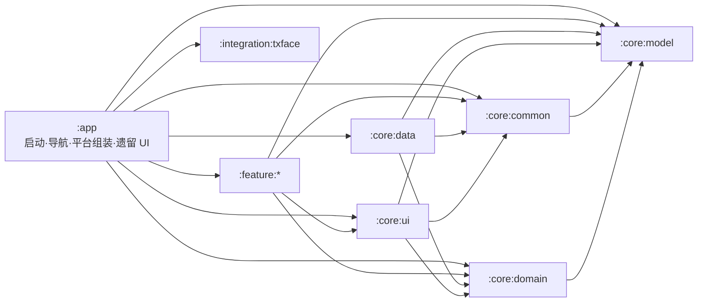

# 系统架构概览

最后核对：2026-09-20（代码与文档静态核对；非本轮全量运行验收）

本文描述当前代码实际运行形态，不把目标架构写成已经完成的事实。版本和依赖见[技术栈与构建基线](tech-stack.md)，产品行为见[产品概览](../product/overview.md)。

## 总体形态

LongCare 是单应用、多模块的 Compose Android 应用。当前采用“壳层 + Core + 部分 Feature 下沉”的过渡架构：

- `:app` 负责 Application/Activity、隐私和会话入口、类型安全导航、Manifest 组件、平台/厂商 SDK 适配，以及仍未迁出的多数 route-bound UI。
- `:feature:carddiagnostics` 提供本地 NFC/R65C UI，登录页中央大 Logo 长按确认后进入，平台读卡监听在 `:app`。
- `:integration:txface` 统一拥有腾讯人脸 SDK；本地 AAR 通过两个纯 artifact wrapper 模块供 Android library 消费。
- `:core:*` 提供模型、领域契约、数据实现、通用 UI 和基础设施。
- `:feature:*` 已承接部分业务状态、用例、平台能力或 UI，但模块迁移尚未完成。
- `:baselineprofile` 提供启动测量及 Profile 生成；当前生成器仅有启动、盲滑和返回操作，尚未建立登录后业务旅程断言。



箭头表示允许出现的项目模块依赖；每个模块的精确白名单以 `scripts/quality/module_dependency_allowlist.txt` 为准。

## 模块职责与现实归属

| 模块 | 当前职责 | 当前现实/迁移状态 |
|---|---|---|
| `:app` | 运行时壳、导航、Manifest、平台网关、厂商 UI 控制器、更新任务 | 仍包含护理、销售、NFC、倒计时等大量业务 UI；legacy feature 目录已冻结新增 |
| `:feature:carddiagnostics` | NFC/R65C 本地检测 UI | 不依赖 Data、会话或业务事件总线 |
| `:integration:txface` | 腾讯人脸 SDK adapter、依赖与规则 | `FaceVerifier` 契约不泄漏厂商类型 |
| `:baselineprofile` | Macrobenchmark 旅程与 Baseline Profile 生成 | 使用 Pixel 6 API 33 managed device，目标为 `:app` |
| `:core:model` | 跨层模型、值对象、`ApiResult`、序列化模型 | Kotlin/JVM 模块，不依赖 Android framework |
| `:core:domain` | Repository/网关契约和领域规则 | Kotlin/JVM 模块，不依赖 Android framework 或数据实现 |
| `:core:data` | Retrofit、Room、DataStore/COS 相关实现、Repository 实现和 Hilt 绑定 | 数据实现集中地；不得依赖 feature/UI |
| `:core:common` | 日志、诊断、运行配置、调度器、图片输出/受管文件、通用 Android 能力 | Android library；不是纯 Kotlin 模块 |
| `:core:ui` | 共用 Compose/UI 支撑、共享 ViewModel、统一图片预览及通用按钮文案 | 可依赖 Core 契约，不得访问数据实现 |
| `:feature:login` | 登录 ViewModel、动作接口、DI 和 feature entry | `LoginScreen` 仍在 `:app` |
| `:feature:home` | 首页共享状态、上报能力、动作接口和 feature entry | 护理/销售首页 route UI 仍在 `:app` |
| `:feature:identification` | 身份用例/网关、状态编排、CameraX + ML Kit 人脸采集和默认比对页 | 已拥有默认、手动采集、备用腾讯人脸 UI；`IdentificationScreen` 主页面仍在 `:app` |
| `:feature:location` | 定位 Service、管理器、会话、上报、诊断 | 作为服务流程内嵌能力，没有独立路由 |
| `:feature:photoupload` | 上传门面、任务队列、标准相机/水印与照片处理状态 | `PhotoUploadScreen` 仍在 `:app`；`CameraScreen` 已共享 |
| `:feature:servicecountdown` | 倒计时状态、轮询和平台网关契约 | route UI、Service、闹钟实现仍在 `:app` |

## 启动与会话

1. `MainActivity` 使用 Hilt，启用 edge-to-edge，并把 UI 交给 `MainApp`。
2. 未同意隐私政策时只显示同意弹窗；同意后执行需要用户授权的后置初始化。
3. `MainViewModel` 暴露持久会话：
   - `Unknown` → 启动进度页
   - `LoggedOut` → `LoginRoute`
   - `LoggedIn` → `HomeRoute`；恢复前校验账号身份，退出或换号清理旧栈
4. 全局 `SessionInvalidationHandler` 负责失效提示与退出；业务页面不各自实现一套登出导航。
5. WorkManager 启动任务检查新版本；UI 只观察最新一次启动请求，避免历史成功任务重新弹出旧更新。

## 导航组装

导航使用 Navigation 3 的可序列化 NavKey、唯一 entry ID 和可保存单栈，由 NavDisplay 管理页面生命周期，并在 `:app/navigation` 统一注册：

- Entry：登录、Home 和订单列表；首页、计划和记录列表显式共享 Home entry 的 TodayOrderViewModel owner。
- Service flow：服务详情、护理执行、NFC、选择服务、照片上传、倒计时、结束选择、完成摘要。
- Support：用户列表/记录、身份与默认人脸核验、相机、手动人脸采集和 WebView；旧设备选择页、人脸引导页及正式应用腾讯测试路由已移除。

所有应用内 H5 共用 `WebViewScreen` 与 `NativeBridge`；隐私网页以 Dialog 包裹同一容器，
启用 JavaScript 但关闭仅映射到网页 dismiss，不触发隐私同意/拒绝。当前唯一公开接口为
`window.NativeBridge.closeWebView()`，保留主线程、前台生命周期、去重及路由 entry 校验。
内部 H5 不设置额外 URL 白名单或导航拦截；新增方法直接放入 NativeBridge 并显式添加注解，不使用通用分发框架。

订单相关路由传递轻量 `OrderNavParams(orderId, planId)`，页面再通过 Repository/共享状态加载业务数据。跨页面结果使用 entry ID 定向的可保存邮箱，保留原 key 与 StateFlow 契约；消费会发出空值，图片 map 只编码文件引用和元数据。来源已离开的回调不可修改新栈。服务完成保留 Home、移除执行中间页，普通返回到首页。

当前只有 login、home、identification 三个 feature entry 常量进入运行时 registry；registry 的数量校验不是完整路由清单。完整页面映射见[页面与路由地图](ui-and-screen-map.md)。

## 状态与异步约定

- 可持续渲染状态使用 `StateFlow`，Compose 使用 `collectAsStateWithLifecycle()`。
- 会触发导航或用户可见结果的重要动作必须可确认消费，避免用 `SharedFlow(replay = 0)` 承载不能丢失的事件。
- replay-zero 流只用于允许观察者缺席时丢失的实时输入或诊断信号，例如 NFC/RFID 瞬时事件。
- 协程取消必须继续抛出 `CancellationException`；敏感流程由质量脚本扫描。
- ViewModel 不持有 Activity；需要 Activity、Context、Service、闹钟、安装器或厂商 SDK UI 时通过 app-owned gateway/controller。
- Repository 会话写入为 suspend 操作，调用者不能在 DataStore 持久化完成前报告登录/退出成功。

## 数据与持久化

- Retrofit + Moshi 承载 LongCare API；API 方法、路径、参数注解和关键 JSON 字段由契约测试保护。
- 正式 Moshi 由 `:core:data` 的 DI 配置提供；`DefaultMoshi` 仅在 App 测试源集中使用。
- Room 当前 schema 版本为 3，schema JSON 保存在 `app/schemas`。`DatabaseModule` 当前使用 `fallbackToDestructiveMigration(dropAllTables = true)`；测试明确验证 v1/v2 升至 v3 时重建，v3 普通重开保留数据。当前没有显式 Migration 链，不能把重建测试当成数据保留证明。后续 schema 变更须先评估本地状态/未上传照片的保留需求，提交 schema 与对应升级测试，不扩大重建策略。
- DataStore 保存会话、偏好和少量兼容记录。
- WorkManager 用于启动更新检查、APK 下载等需要跨重建继续或恢复结果的任务。
- 腾讯 COS 负责业务图片/文件上传，Feature 通过 `PhotoCloudUploader` 等受校验门面使用。
- Debug 可选的本地 mock 只存在于 debug source set，不进入 Release。

## 图片与人脸链路

- 标准业务照片统一进入 `CameraRoute`，由 `UnifiedImagePipeline` 完成 EXIF 方向修正、水印、JPEG 压缩、原子写入、大小校验和受管文件生命周期。
- `ImageProcessingPolicies` 集中维护图片参数；业务页面不得各自硬编码压缩策略。
- `PhotoPreviewDialog` 是通用全屏预览实现。
- 订单图片行删除与受管文件删除在数据层耦合，单张删除、整单清理和完成流程使用同一生命周期。
- 默认服务人员核验由 `:feature:identification` 的 CameraX/ML Kit 流程完成：单人/姿态检查 → 建立睁眼基线 → 闭眼 → 稳定睁开 → 拍摄 → 编码 → `/V1/User/CheckFace`。
- 服务端登记照只作为“是否需要补录”的权威状态，不重新下载为客户端本地缓存；旧版遗留文件在需要补录时清理。
- 腾讯人脸 SDK 和手动采集仍保留兼容/验证路径，但不是默认订单核验入口。

## Android 组件边界

最终组件来自 app、feature Manifest 和 AAR 合并：

- Activity：
  - `MainActivity`
  - `CountdownAlarmActivity`
  - QLZ SDK 的内部 `MainLoadingActivity`
- Service：
  - 订单定位 `LocationTrackingService` 和 AMap `APSService`（`location` 类型）
  - 倒计时前台 Service（`specialUse`）
  - 响铃 Service（`mediaPlayback`）
- Receiver：倒计时、关闭响铃、服务结束提醒和设备启动恢复。
- Provider：受限 `FileProvider`；WorkManager 默认 initializer 被移除，改为应用自定义配置。

主应用不新增检测 Activity 或检测 Launcher；登录页中央大 Logo 长按确认后在既有 NavDisplay 内打开读卡页，不使用传感器或震动。NFC Reader Mode 只回调当前页面，退出即释放，不向业务事件总线派发。SDK 内部 Activity 不导出。

## 权限与平台约束

- 相机、人脸、NFC、蓝牙、定位、通知、精确闹钟、全屏提醒和应用安装均按业务入口请求，不应在 Application 无条件触发。
- Android 14+ 的前台服务类型及对应权限在 Manifest 中显式声明；定位 Service 只能在满足位置服务和运行时权限的用户可见流程中启动。
- 正式主入口 `MainActivity` 当前锁定竖屏；`CountdownAlarmActivity` 的源 Manifest 没有方向锁定声明。targetSdk 36 在 sw600dp+ 默认忽略方向/可调整大小限制，项目用 Activity 级 `PROPERTY_COMPAT_ALLOW_RESTRICTED_RESIZABILITY` 暂时退出该行为。
- Android API 37 会取消上述大屏退出能力；在升级 targetSdk 37 前必须完成旋转、多窗口、相机预览和状态恢复验证。
- 顶层护理/销售导航已经使用 Material 3 Adaptive Navigation Suite，根据窗口尺寸选择底栏或导航轨。

## 外部集成

| 集成 | 用途 | 代码边界 |
|---|---|---|
| AMap Location | 服务中定位和单次业务定位 | `:feature:location`；平台 Service 在模块 Manifest 中声明 |
| Tencent COS | 图片/文件对象存储 | `:core:data` 实现，Feature 使用领域契约/上传门面 |
| CameraX + ML Kit | 标准相机、人脸检测和眨眼活体 | `:feature:photoupload` 与 `:feature:identification` |
| Tencent Face | 旧版/兼容人脸验证 | `:integration:txface` adapter + `:core:ui` UI controller，默认订单核验不进入该 SDK |
| QLZ | 销售蓝牙设备自动评估 | app-owned SDK controller；Sale API 分层在 Core |
| Bugly | 同意后的崩溃上报 | `CrashReportGateway`；Debug/未初始化路径不调用远端 runtime |
| WorkManager | 更新检查、下载与可恢复后台任务 | 自定义初始化，Worker 位于 `:app` |

## 构建与发布现实

- Debug、Release、nonMinifiedRelease 和 benchmarkRelease 变体由 Android CLI/Gradle 识别。
- Android CI 的正常阻断路径以构建、Lint、架构和治理为主，读卡 Feature 和主应用长按入口、NFC 平台、导航专项单测纳入阻断，正式业务全量单测仍不作为普通 CI 必跑；本地 `--full` 和专项验证仍应运行相关测试。
- 正式构建统一使用标准 Release，保留正式签名、R8 和资源压缩；仅提供主应用 APK/AAB，历史助手附件保持不变。
- 当前 QLZ key/test mode、QLZ 1.3.0.5 弱 TLS 和腾讯人脸 6.6.2 已知问题经用户明确接受，Release 输出警告；正式签名、其他质量和产物检查仍必须通过，不将风险接受视为问题修复。

## 已接受的技术债

- 大多数 route-bound UI 仍位于 `:app/features/**`。
- `:app` 同时承担壳层、平台适配和较多业务组装；新增 legacy feature 文件受 allowlist/freeze guard 约束。
- 销售体验仍由 `:app` 持有，`SalesViewModel` 体量较大。
- Navigation 3 路由和三个 feature entry 常量还不是统一的 feature-owned 导航模型。
- Manifest 组件面较广，源于定位、计时、闹钟、NFC、更新和厂商 SDK 的现实需求。
- Jetifier 移除及厂商风险修复依赖兼容的新 AAR；当前发布风险接受不等于完成这些修复，也不允许忽略其他 Lint 或签名问题。

后续优先级与实施验收见[整体分析第 16～18 章](../analysis/project-review.md#16-风险与优化事项登记)。

## 读卡检测隐私与运行时

检测仅在全局隐私同意后的登录页通过中央大 Logo 长按及确认进入，不创建单独登录、照片缓存或上传流程。NFC/R65C 只在对应模式前台监听，切换、后台和退出释放；返回原登录表单。未完成长按与确认状态不跨后台恢复。

## 依赖与架构规则

以下是开发约束。当前 App 中仍有业务实现，不构成新增 legacy 代码的许可。

### 项目模块依赖

精确机器真相是 `scripts/quality/module_dependency_allowlist.txt`。当前允许的项目模块边如下：

| 源模块 | 允许依赖的项目模块 |
|---|---|
| `:app` | `:baselineprofile`、全部 `:core:*`、全部现有 `:feature:*`、`:integration:txface` |
| `:feature:carddiagnostics` | `:core:common` |
| `:integration:txface` | `:core:common`、`:core:domain`、`:core:model`，本地来源时依赖 txface-live/txface-normal artifact wrapper |
| `:integration:txface-live` / `:integration:txface-normal` | 无项目依赖，仅暴露现有 AAR artifact |
| `:baselineprofile` | 无 |
| `:core:model` | 无 |
| `:core:domain` | `:core:model` |
| `:core:common` | `:core:model` |
| `:core:data` | `:core:common`、`:core:domain`、`:core:model` |
| `:core:ui` | `:core:common`、`:core:domain`、`:core:model` |
| `:feature:home` | `:core:domain`、`:core:model` |
| 其他现有 `:feature:*` | `:core:common`、`:core:domain`、`:core:model`；identification 和 photoupload 额外允许 `:core:ui` |

读卡检测 UI/HID 状态由 `:feature:carddiagnostics` 持有，只依赖 `:core:common`；平台监听由 `:app` 管理，不依赖业务 Repository 或事件总线。

新增或修改 Gradle 项目依赖时，必须同步检查实际 build 文件和 allowlist；不能只更新本文。

### 分层边界

#### Model

- `:core:model` 是 Kotlin/JVM 模块，只保存跨层模型和值对象。
- 禁止引入 Android framework。
- 网络字段注解只在确有共享序列化契约时保留；不要把 Retrofit 接口或数据源实现放入 Model。

#### Domain

- `:core:domain` 是 Kotlin/JVM 模块，保存 Repository/网关契约和跨 feature 的领域规则。
- 禁止 `android.*`、Activity/Context、Retrofit、Room、具体 SDK 类型和 `*Impl`。
- Feature 依赖抽象，不依赖 `:core:data`。

#### Data

- `:core:data` 实现 Domain 契约，拥有 Retrofit、Room、COS、DataStore 相关数据访问和绑定。
- 网络专用 DTO、接口路径、参数注解和数据源应隐藏在 Data 边界内。
- Data 不得依赖 Feature/UI，也不得反向调用页面导航。

#### Common 与 UI

- `:core:common` 是 Android library，可持有真正跨业务复用的基础能力；它不是无边界的杂物目录。
- `:core:ui` 只保存通用 UI、主题/组件和 UI 支撑，禁止网络、数据库或 Repository 实现。
- 只被一个 feature 使用的 helper 优先留在该 feature，不要为了“复用可能性”提前放入 Core。

#### Feature

- Feature 负责一组紧密相关的用户能力、状态和 UI/编排。
- Feature 只能使用允许的 Core 抽象，禁止直接依赖 Data 实现或另一个 Feature 的 internal 实现。
- 公共入口保持最小；非契约声明使用 `internal` / `private`。
- 新业务 UI 应优先进入 `:feature:*`，不要继续扩大 `:app/features/**`。

#### App

- 目标职责是启动、根导航、DI 组装、Manifest 和 Android/厂商平台适配。
- 当前仍有大量 route-bound UI 和流程代码，因此 `:app` 对 Core/Data/Feature 的依赖是现实允许边，而不是鼓励新业务继续堆入壳层。
- `app/src/main/.../features/**` 受冻结目录和文件 allowlist 保护；优先在现有允许文件内做小修复，新增能力迁往 Feature。


### 实施约束与例外

运行时状态、平台、数据和导航规则分别见本文对应章节；页面归属与结果 key 见[页面地图](ui-and-screen-map.md)。补充约束：

- ViewModel 通过 UseCase/Repository 契约访问数据，调度器经 DI 注入；用户文案使用资源或可测试文本抽象。
- 平台资源在对应生命周期释放；权限拒绝、设置返回与后台恢复必须可验证。
- Release 组件默认 `exported=false`；新增导出组件须安全审查、最小 intent surface 和 allowlist 更新。
- Retrofit 方法、路径、注解与 JSON key 变动同步契约测试；持久任务不能只依赖进程内事件。
- 生产 secret 不得写入源码、资源、BuildConfig、日志或 APK；客户端使用受限 token/临时凭据。QLZ 保留用户确认可用于正式环境的 appKey，appSecret 仅在服务端；不能把客户端 appKey 配置扩展到其他秘密凭据。
- 路由优化保持现有 Navigation 3 entry 邮箱、轻量参数和消费清理契约；不与业务 API 变化或大规模模块搬迁混在一次修改中。
- 架构例外在 PR 写明原因、影响与回收条件，只改最小 allowlist/预算，并增加防扩散守卫。长期取舍记录 ADR；短期执行过程留在 PR/Issue。

自动检查及执行范围统一见[CI 与质量门禁](ci-quality-gates.md)。

## ADR-001：分层边界

- Status: Accepted
- Date: 2026-02-13
- Owners: LongCare Android Team

**背景**：项目由单 App 演进，虽有 domain/data/features 目录，曾缺少可执行依赖约束，造成 UI 访问 Data 实现、Domain 混入 Android 类型和评审标准不统一。

**决策**：UI/Feature 通过 Domain 接口与模型调用业务能力；Data 实现 Domain，承担网络/数据库/存储；Domain 保持纯 Kotlin。Repository 接口在 Domain、实现在 Data、装配在 DI，禁止 Feature import Data Impl 和 Domain import Android；ViewModel 不实现数据访问细节。当前允许的 Core 基础依赖以本页依赖表及机器白名单为准。

**影响**：统一评审标准、提高业务可测试性并支持渐进模块化；代价是接口与 DI 绑定维护成本。CI 架构守卫和 PR review 持续执行这些约束。该决策表达分层方向，不证明当前所有 UI 已迁出 App。

## 定位会话与生命周期

### 业务边界

- 只有业务会话确认订单执行中时才启动订单持续定位与上报；单次定位不受订单限制。
- App 切到后台后，由 `location` 类型前台 Service 继续采集和上报。
- 单个定位点上传失败后直接丢弃；不落库、不排队、不补传。
- 订单结束成功、退出登录、Token 失效、账号切换、划掉任务或进程终止时停止。
- App 重启、设备重启或重新登录后不自动恢复旧订单定位。
- 用户重新进入服务订单时创建新会话并重新确认服务中，确认后恢复持续上报；
  不依赖旧进程状态，不补传旧定位，订单已结束则不启动。

### 核心组件

1. `LocationFacade`
   - 统一提供快速定位、新鲜定位、缓存定位和前台保活控制。
2. `LocationKeepAliveManager`
   - 以进程内 owner 和 generation 管理前台 Service，不持久化 desired state。
3. `LocationTrackingService`
   - 持有前台通知、高德持续定位 collector 和唯一 `AddPostion` 调用点，不查询订单状态。
4. `LocationSampleStore`
   - 保存短时缓存并发布实时样本；上报消费端使用 conflate，仅保留一个最新待处理点。
5. `LocationReportingManager`
   - 实现业务层 `ServiceOrderLifecycle`，统一同步订单状态，驱动上报会话启停，不执行上传。
   - 状态同步不依赖页面存活；倒计时页面仅订阅同一份状态，不重复请求。
6. `LocationSessionLifecycleObserver`
   - 登出或账号切换时强制停止；登录时绝不恢复定位。

### 启停上报

```kotlin
trackingManager.startTracking(orderKey)
trackingManager.stopTracking()
```

结束接口成功后，业务执行器立即调用 `ServiceOrderLifecycle.onOrderEnded(orderId)`，
先使对应会话失效并取消在途协程，再停止 Android Service，最后执行 UI/资源清理。
结束接口失败、仅打开结束确认流程、倒计时归零均不会结束真实业务会话。

正式开始接口成功是服务中的直接依据；随后通过定位权限入口启动 Service，
不必等待额外状态查询成功。重新打开订单、进程重建时则先重新确认状态。
正常业务状态同步每 5 秒一次，与上传结果无关。
初始状态不可用时不启动定位，按 5/10/20/40/60 秒退避持续复核，网络恢复后可继续。
已确认服务中时，查询异常保留最后已确认状态，不因异常次数永久停报；
查询确认非服务中则立即停止，不等待用户确认弹窗。

`AddPostion` 没有“非服务中”专用错误码。上传结果仅记录诊断，不触发状态反查、
不修改订单状态、不弹 Toast、不因业务失败停报，不重试同一个定位点。
既有全局登录失效安全处理保持不变。后台远程状态变化存在同步延迟，
已发出的请求无法撤回，服务端仍需校验订单状态。

### 单次业务定位

```kotlin
val location = locationFacade.getCurrentLocation()
val freshLocation = locationFacade.getFreshLocation()
```

单次定位使用独立高德客户端，不会创建第二个持续定位 collector，也不进入实时上报链路。

### Android 生命周期

- 前台 Service 必须从用户可见的订单流程中启动，并声明 `foregroundServiceType="location"`。
- 状态确认完成时若系统不允许启动 Service，在用户返回订单页面时显式重试；不使用后台重启调度。
- Service 返回 `START_NOT_STICKY`，不要求系统在进程终止后重建。
- Service 使用 `stopWithTask=true`，显式停止和 `onDestroy()` 共用幂等 SDK 清理路径。
- 进程被硬终止时 Android 不保证调用 `onDestroy()`；不恢复的保证来自“没有任何持久队列或调度任务”。
