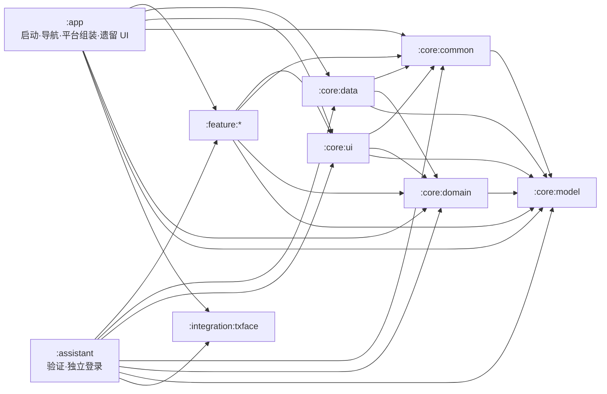

# 系统架构概览

最后核对：2026-09-08

本文描述当前代码实际运行形态，不把目标架构写成已经完成的事实。版本和依赖见[技术栈与构建基线](tech-stack.md)，产品行为见[产品概览](../product/overview.md)。

## 总体形态

LongCare 是双 APK、多模块的 Compose Android 应用。当前采用“壳层 + Core + 部分 Feature 下沉”的过渡架构：

- `:app` 负责 Application/Activity、隐私和会话入口、类型安全导航、Manifest 组件、平台/厂商 SDK 适配，以及仍未迁出的多数 route-bound UI。
- `:assistant` 是独立验证应用，与正式 App 不互相依赖；通过同一 Core/Feature/腾讯集成层验证五项能力。
- `:integration:txface` 统一拥有腾讯人脸 SDK；本地 AAR 通过两个纯 artifact wrapper 模块供 Android library 消费。
- `:core:*` 提供模型、领域契约、数据实现、通用 UI 和基础设施。
- `:feature:*` 已承接部分业务状态、用例、平台能力或 UI，但模块迁移尚未完成。
- `:baselineprofile` 生成启动和关键旅程的 Baseline Profile。

箭头表示允许出现的项目模块依赖；每个模块的精确白名单以 `scripts/quality/module_dependency_allowlist.txt` 为准。

## 模块职责与现实归属

| 模块 | 当前职责 | 当前现实/迁移状态 |
|---|---|---|
| `:app` | 运行时壳、导航、Manifest、平台网关、厂商 UI 控制器、更新任务 | 仍包含护理、销售、NFC、倒计时等大量业务 UI；legacy feature 目录已冻结新增 |
| `:assistant` | 独立隐私/登录和五项验证导航 | 不注册正式业务路由；本地沙箱、组件和会话独立 |
| `:integration:txface` | 腾讯人脸 SDK adapter、依赖与规则 | `FaceVerifier` 契约不泄漏厂商类型 |
| `:baselineprofile` | Macrobenchmark 旅程与 Baseline Profile 生成 | 使用 Pixel 6 API 33 managed device，目标为 `:app` |
| `:core:model` | 跨层模型、值对象、`ApiResult`、序列化模型 | Kotlin/JVM 模块，不依赖 Android framework |
| `:core:domain` | Repository/网关契约和领域规则 | Kotlin/JVM 模块，不依赖 Android framework 或数据实现 |
| `:core:data` | Retrofit、Room、DataStore/COS 相关实现、Repository 实现和 Hilt 绑定 | 数据实现集中地；不得依赖 feature/UI |
| `:core:common` | 日志、诊断、运行配置、调度器、图片输出/受管文件、通用 Android 能力 | Android library；不是纯 Kotlin 模块 |
| `:core:ui` | 共用 Compose/UI 支撑、共享 ViewModel、统一图片预览 | 可依赖 Core 契约，不得访问数据实现 |
| `:feature:login` | 登录 ViewModel、动作接口、DI 和 feature entry | `LoginScreen` 仍在 `:app` |
| `:feature:home` | 首页共享状态、上报能力、动作接口和 feature entry | 护理/销售首页 route UI 仍在 `:app` |
| `:feature:identification` | 身份用例/网关、状态编排、CameraX + ML Kit 人脸采集和默认比对页 | 已拥有默认、手动采集、备用腾讯人脸 UI；`IdentificationScreen` 主页面仍在 `:app` |
| `:feature:location` | 定位 Service、管理器、会话、上报、诊断 | 作为服务流程内嵌能力，没有独立路由 |
| `:feature:photoupload` | 上传门面、任务队列、标准相机/水印与照片处理状态 | `PhotoUploadScreen` 仍在 `:app`；`CameraScreen` 已共享 |
| `:feature:servicecountdown` | 倒计时状态、轮询和平台网关契约 | route UI、Service、闹钟实现仍在 `:app` |

## 启动与会话

1. `MainActivity` 使用 Hilt，启用 edge-to-edge，并把 UI 交给 `MainApp`。
2. 未同意隐私政策时只显示同意弹窗；同意后执行需要用户授权的后置初始化。
3. `MainViewModel` 暴露持久会话：
   - `Unknown` → 启动进度页
   - `LoggedOut` → `LoginRoute`
   - `LoggedIn` → `HomeRoute`；恢复前校验账号身份，退出或换号清理旧栈
4. 全局 `SessionInvalidationHandler` 负责失效提示与退出；业务页面不各自实现一套登出导航。
5. WorkManager 启动任务检查新版本；UI 只观察最新一次启动请求，避免历史成功任务重新弹出旧更新。

## 导航组装

导航使用 Navigation 3 的可序列化 NavKey、唯一 entry ID 和可保存单栈，由 NavDisplay 管理页面生命周期，并在 `:app/navigation` 统一注册：

- Entry：登录、Home 和订单列表；首页、计划和记录列表显式共享 Home entry 的 TodayOrderViewModel owner。
- Service flow：服务详情、护理执行、NFC、选择服务、照片上传、倒计时、结束选择、完成摘要。
- Support：用户列表/记录、人脸引导与核验、设备选择、相机、手动人脸采集和 WebView。

所有应用内 H5 共用 `WebViewScreen` 与 `NativeBridge`；隐私网页以 Dialog 包裹同一容器，
启用 JavaScript 但关闭仅映射到网页 dismiss，不触发隐私同意/拒绝。当前唯一公开接口为
`window.NativeBridge.closeWebView()`，保留主线程、前台生命周期、去重及路由 entry 校验。
内部 H5 不设置额外 URL 白名单或导航拦截；新增方法直接放入 NativeBridge 并显式添加注解，不使用通用分发框架。

订单相关路由传递轻量 `OrderNavParams(orderId, planId)`，页面再通过 Repository/共享状态加载业务数据。跨页面结果使用 entry ID 定向的可保存邮箱，保留原 key 与 StateFlow 契约；消费会发出空值，图片 map 只编码文件引用和元数据。来源已离开的回调不可修改新栈。服务完成保留 Home、移除执行中间页，普通返回到首页。

当前只有 login、home、identification 三个 feature entry 常量进入运行时 registry；registry 的数量校验不是完整路由清单。完整页面映射见[页面与路由地图](ui-and-screen-map.md)。

## 状态与异步约定

- 可持续渲染状态使用 `StateFlow`，Compose 使用 `collectAsStateWithLifecycle()`。
- 会触发导航或用户可见结果的重要动作必须可确认消费，避免用 `SharedFlow(replay = 0)` 承载不能丢失的事件。
- replay-zero 流只用于允许观察者缺席时丢失的实时输入或诊断信号，例如 NFC/RFID 瞬时事件。
- 协程取消必须继续抛出 `CancellationException`；敏感流程由质量脚本扫描。
- ViewModel 不持有 Activity；需要 Activity、Context、Service、闹钟、安装器或厂商 SDK UI 时通过 app-owned gateway/controller。
- Repository 会话写入为 suspend 操作，调用者不能在 DataStore 持久化完成前报告登录/退出成功。

## 数据与持久化

- Retrofit + Moshi 承载 LongCare API；API 方法、路径、参数注解和关键 JSON 字段由契约测试保护。
- Room 当前 schema 版本为 3，schema JSON 保存在 `app/schemas`；升级必须提供显式 Migration 和迁移测试，不允许异常时删库重建。
- DataStore 保存会话、偏好和少量兼容记录。
- WorkManager 用于启动更新检查、APK 下载等需要跨重建继续或恢复结果的任务。
- 腾讯 COS 负责业务图片/文件上传，Feature 通过 `PhotoCloudUploader` 等受校验门面使用。
- Debug 可选的本地 mock 只存在于 debug source set，不进入 Release。

## 图片与人脸链路

- 标准业务照片统一进入 `CameraRoute`，由 `UnifiedImagePipeline` 完成 EXIF 方向修正、水印、JPEG 压缩、原子写入、大小校验和受管文件生命周期。
- `ImageProcessingPolicies` 集中维护图片参数；业务页面不得各自硬编码压缩策略。
- `PhotoPreviewDialog` 是通用全屏预览实现。
- 订单图片行删除与受管文件删除在数据层耦合，单张删除、整单清理和完成流程使用同一生命周期。
- 默认服务人员核验由 `:feature:identification` 的 CameraX/ML Kit 流程完成：单人/姿态检查 → 建立睁眼基线 → 闭眼 → 稳定睁开 → 拍摄 → 编码 → `/V1/User/CheckFace`。
- 服务端登记照只作为“是否需要补录”的权威状态，不重新下载为客户端本地缓存；旧版遗留文件在需要补录时清理。
- 腾讯人脸 SDK 和手动采集仍保留兼容/验证路径，但不是默认订单核验入口。

## Android 组件边界

最终组件来自 app、feature Manifest 和 AAR 合并：

- Activity：
  - `MainActivity`
  - `CountdownAlarmActivity`
  - QLZ SDK 的内部 `MainLoadingActivity`
- Service：
  - 订单定位 `LocationTrackingService` 和 AMap `APSService`（`location` 类型）
  - 倒计时前台 Service（`specialUse`）
  - 响铃 Service（`mediaPlayback`）
- Receiver：倒计时、关闭响铃、服务结束提醒和设备启动恢复。
- Provider：受限 `FileProvider`；WorkManager 默认 initializer 被移除，改为应用自定义配置。

正式 App 不再包含验证 Activity、Logo 长按入口或验证 Launcher。助手仅导出 `AssistantActivity`（MAIN/LAUNCHER），无外部测试深链；NFC 只通过前台显式 PendingIntent 进入，离开测试页即停用。SDK 内部 Activity 不导出，provider authority 使用各自 applicationId。

## 权限与平台约束

- 相机、人脸、NFC、蓝牙、定位、通知、精确闹钟、全屏提醒和应用安装均按业务入口请求，不应在 Application 无条件触发。
- Android 14+ 的前台服务类型及对应权限在 Manifest 中显式声明；定位 Service 只能在满足位置服务和运行时权限的用户可见流程中启动。
- 正式应用自有 Activity 当前锁定竖屏；助手不锁定方向。targetSdk 36 在 sw600dp+ 默认忽略方向/可调整大小限制，项目用 Activity 级 `PROPERTY_COMPAT_ALLOW_RESTRICTED_RESIZABILITY` 暂时退出该行为。
- Android API 37 会取消上述大屏退出能力；在升级 targetSdk 37 前必须完成旋转、多窗口、相机预览和状态恢复验证。
- 顶层护理/销售导航已经使用 Material 3 Adaptive Navigation Suite，根据窗口尺寸选择底栏或导航轨。

## 外部集成

| 集成 | 用途 | 代码边界 |
|---|---|---|
| AMap Location | 服务中定位和单次业务定位 | `:feature:location`；平台 Service 在模块 Manifest 中声明 |
| Tencent COS | 图片/文件对象存储 | `:core:data` 实现，Feature 使用领域契约/上传门面 |
| CameraX + ML Kit | 标准相机、人脸检测和眨眼活体 | `:feature:photoupload` 与 `:feature:identification` |
| Tencent Face | 旧版/兼容人脸验证 | `:integration:txface` adapter + `:core:ui` UI controller，默认订单核验不进入该 SDK |
| QLZ | 销售蓝牙设备自动评估 | app-owned SDK controller；Sale API 分层在 Core |
| Bugly | 同意后的崩溃上报 | `CrashReportGateway`；Debug/未初始化路径不调用远端 runtime |
| WorkManager | 更新检查、下载与可恢复后台任务 | 自定义初始化，Worker 位于 `:app` |

## 构建与发布现实

- Debug、Release、nonMinifiedRelease 和 benchmarkRelease 变体由 Android CLI/Gradle 识别。
- Android CI 的正常阻断路径以构建、Lint、架构和治理为主，助手单测纳入阻断，正式业务全量单测仍不作为普通 CI 必跑；本地 `--full` 和专项验证仍应运行相关测试。
- 验收 Release 必须显式设置 `release.production=false` 和 `release.acceptance=true`。
- 当前 QLZ key/test mode、QLZ 1.3.0.5 弱 TLS 和腾讯人脸 6.6.2 已知问题经用户明确接受，production 输出警告；正式签名、其他质量和产物检查仍必须通过，不将风险接受视为问题修复。

## 已接受的技术债

- 大多数 route-bound UI 仍位于 `:app/features/**`。
- `:app` 同时承担壳层、平台适配和较多业务组装；新增 legacy feature 文件受 allowlist/freeze guard 约束。
- 销售体验仍由 `:app` 持有，`SalesViewModel` 体量较大。
- Navigation 3 路由和三个 feature entry 常量还不是统一的 feature-owned 导航模型。
- Manifest 组件面较广，源于定位、计时、闹钟、NFC、更新和厂商 SDK 的现实需求。
- Jetifier 移除及厂商风险修复依赖兼容的新 AAR；当前发布风险接受不等于完成这些修复，也不允许忽略其他 Lint 或签名问题。

后续优先级见[路线图与开放问题](roadmap-and-open-gaps.md)，强制边界见[依赖规则](dependency-rules.md)。

## 助手隐私与运行时

助手拥有独立 Application、DataStore、数据库和私有照片缓存。隐私同意前不创建联网 ViewModel，ML Kit 显式延后初始化；不启用 Bugly 上报、QLZ、更新 Worker 或护理定位服务。可选系统单次定位只用于相机水印。默认和备用人脸需助手登录，NFC/标准相机/手动采集无需登录；待继续路由保存在 SavedStateHandle，成功消费一次，取消和退出清理。服务端可能限制同账号多端登录，本地隔离不代表后端会话互不影响。
