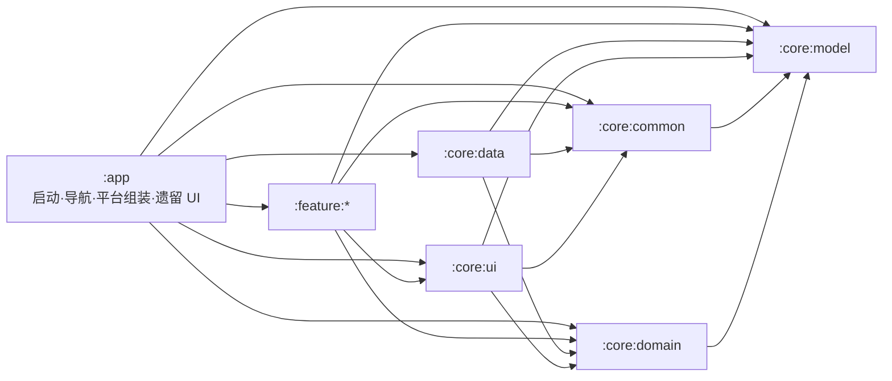

# 系统架构概览

最后核对：2026-08-31

本文描述当前代码实际运行形态，不把目标架构写成已经完成的事实。版本和依赖见[技术栈与构建基线](tech-stack.md)，产品行为见[产品概览](../product/overview.md)。

## 总体形态

LongCare 是单 APK、多模块的 Compose Android 应用。当前采用“壳层 + Core + 部分 Feature 下沉”的过渡架构：

- `:app` 负责 Application/Activity、隐私和会话入口、类型安全导航、Manifest 组件、平台/厂商 SDK 适配，以及仍未迁出的多数 route-bound UI。
- `:core:*` 提供模型、领域契约、数据实现、通用 UI 和基础设施。
- `:feature:*` 已承接部分业务状态、用例、平台能力或 UI，但模块迁移尚未完成。
- `:baselineprofile` 生成启动和关键旅程的 Baseline Profile。



箭头表示允许出现的项目模块依赖；每个模块的精确白名单以 `scripts/quality/module_dependency_allowlist.txt` 为准。

## 模块职责与现实归属

| 模块 | 当前职责 | 当前现实/迁移状态 |
|---|---|---|
| `:app` | 运行时壳、导航、Manifest、平台网关、厂商 UI 控制器、更新任务 | 仍包含护理、销售、NFC、相机、倒计时等大量业务 UI；legacy feature 目录已冻结新增 |
| `:baselineprofile` | 六场景 Profile 生成、对称 Startup Macrobenchmark 与报告 | 使用 Pixel 6 API 33 managed device 验证旅程/依赖/报告格式，目标为 `:app`；性能收益仍由受控 ARM64 真机验收 |
| `:core:model` | 跨层模型、值对象、`ApiResult`、序列化模型 | Kotlin/JVM 模块，不依赖 Android framework |
| `:core:domain` | Repository/网关契约和领域规则 | Kotlin/JVM 模块，不依赖 Android framework 或数据实现 |
| `:core:data` | Retrofit、Room、DataStore/COS 相关实现、Repository 实现和 Hilt 绑定 | 数据实现集中地；不得依赖 feature/UI |
| `:core:common` | 日志、诊断、运行配置、调度器、图片输出/受管文件、通用 Android 能力 | Android library；不是纯 Kotlin 模块 |
| `:core:ui` | 共用 Compose/UI 支撑、共享 ViewModel、统一图片预览 | 可依赖 Core 契约，不得访问数据实现 |
| `:feature:login` | 登录公开入口、内部 Compose UI/资源、ViewModel、协议链接选择、动作接口和 DI | `LoginFeatureScreen` 是唯一公开页面入口；app 只持有 route、协议兜底和平台动作适配 |
| `:feature:home` | 首页共享状态、上报能力和动作接口 | 护理/销售首页 route UI 仍在 `:app` |
| `:feature:identification` | 身份主页面/资源、聚合屏幕状态、用例/网关、CameraX + ML Kit 人脸采集和默认比对页 | `IdentificationFeatureScreen` 是唯一公开页面入口；内部渲染 UI/VM 不向 `:app` 暴露 |
| `:feature:location` | 定位 Service、管理器、会话、上报、诊断 | 作为服务流程内嵌能力，没有独立路由 |
| `:feature:photoupload` | 上传门面、任务队列和照片处理状态 | `PhotoUploadScreen`、`CameraScreen` 仍在 `:app` |
| `:feature:servicecountdown` | 倒计时状态、轮询和平台网关契约 | route UI、Service、闹钟实现仍在 `:app` |

## 启动与会话

1. `MainApplication` 首先等待 `user_storage_namespace_cutover_v1` marker；首次升级会幂等取消并删除全部已知 legacy 本地状态，marker 未提交时会话、设备标识和用户命名空间均不可用。
2. `MainActivity` 使用 Hilt，启用 edge-to-edge，并把 UI 交给 `MainApp`。
3. 未同意隐私政策时只显示同意弹窗；同意后生成应用私有 GUID，再执行需要授权的 SDK 与 Worker 后置初始化。
4. `MainViewModel` 暴露加密持久会话；只有 `ACTIVE` envelope 对应命名空间通过 metadata 核对并 Ready 后才发布：
   - `Unknown` → 首次解析时只显示启动进度页；认证 NavHost 已建立后则用不透明、拦截输入的进度层覆盖并保留原 back stack
   - `LoggedOut` → `LoginRoute`
   - `LoggedIn` → `HomeGraphRoute`
5. 全局 `SessionInvalidationHandler` 负责失效提示与统一租约撤销；手动退出、Token 失效和换号走同一清理/关闭顺序。
6. 命名空间 Ready 后，`DefaultUserRehydrationCoordinator` 并发拉取系统配置、今日订单和进行中订单，只在当前 lease 仍有效时写入该用户；网络失败进入可重试/空态，不回退 legacy、全局值或另一用户快照。
7. WorkManager 启动任务检查新版本；UI 只观察最新一次启动请求，避免历史成功任务重新弹出旧更新。

启动完成语义按互斥根页面管理：会话仍为 `Unknown` 时 Splash 持有 Activity fully-drawn 条件；隐私协议、Login、护理 Home 或销售 Home 的真实根内容完成首帧且可交互后，当前根页面才释放 `ReportDrawnWhen`。系统继续自动记录 TTID，Macrobenchmark 同时要求 TTFD；更新检查、首屏后网络结果、列表滚动和后续业务导航不延迟 TTFD。Activity 重建会得到新的 reporter，同一 Activity 内的状态变化不会重复报告。

Profile 场景固定为六个：首次隐私、已同意隐私且未登录、护理 Home、销售 Home 属于 Startup；护理 Home → 服务记录 → Home 与销售 Home → 客户列表 → Sales Home 属于 Baseline-only。后两条旅程只扩充 `baseline-prof.txt`，不得进入 `startup-prof.txt`。状态由仅绑定 `nonMinifiedRelease`/`benchmarkRelease` 的 `src/profile` 控制器通过正式隐私、加密会话和用户命名空间 API 建立；组件受 signature permission 保护，准备后强停再冷启动，且 Release Manifest/DEX/assets 必须证明该控制能力和虚构身份不存在。性能变体还在 OkHttp 最前端 fail-fast，确保虚构 token 不接触生产网络；常规 Debug/Release 的该开关恒为关闭。

## 导航组装

导航使用 Navigation Compose 2 的 Kotlin Serialization 类型安全路由，并在 `:app/navigation` 统一注册：

- Entry：登录、Home 子图和订单列表。
- Service flow：服务详情、护理执行、NFC、选择服务、照片上传、倒计时、结束选择、完成摘要。
- Support：用户列表/记录、人脸引导与核验、相机、手动人脸采集和 WebView。

认证入口由 app-owned 协调器把会话状态映射为 `LoginRoute` 或 `HomeGraphRoute`。同一目标的重复信号是 `NoOp`；Login/Home 切换使用类型安全 `popUpTo(inclusive = true)` 删除另一认证根，保证 back stack 不同时保留两个账号边界。`AppNavHost` 和 `EntryDestinationRenderers` 仅作为 `internal` 测试 seam，不是跨模块 API；首次根状态解析完成后 NavController 不因短暂 `Unknown` 或配置变化而重建。

订单相关路由传递轻量 `OrderNavParams(orderId, planId)`，页面再通过 Repository/共享状态加载业务数据。开始服务从护理执行页直接构造 `NfcSignInRoute(SignInMode.START_ORDER)`，返回栈不再包含无行为价值的设备选择目的地。跨页面结果使用上一层 `SavedStateHandle`，例如相机 URI、人脸文件路径和默认人脸核验结果。

`IdentificationRoute` 仍由 `:app` 的 Navigation Compose 2 图注册：壳层解析 route、提供五个导航回调和三个结果流，并使用当前 UI Context 把 app-owned 腾讯人脸控制器适配为 `IdentificationFaceSdkLauncher`；feature 不引用 `NavController`、app 平台实现或 app `R`。三个结果确认后显式写入 `null`，保证既有 `StateFlow` 同步进入已消费状态。

`LoginRoute` 同样保留 app-owned Navigation Compose 2 注册，但只调用 `LoginFeatureScreen`。`:app` 注入 `LoginAgreementLinks`、开放 WebView 回调及相机、备用人脸、手动人脸、正式人脸和 NFC 五个验证动作；`:feature:login` 拥有渲染、资源、协议确认、动态 URL 选择和状态 effect，不接收 `NavController`、`Context`、`Activity`、`Intent` 或厂商类型。服务端非空用户协议地址原样优先，空值/加载失败与隐私政策使用 app 兜底，不增加 host 白名单。

工程不维护与真实导航图平行的 feature entry 字符串 registry；可达页面只以 `:app/navigation` 的 typed route 注册和对应 feature 公共 screen/action 合约为准。完整页面映射见[页面与路由地图](ui-and-screen-map.md)。

## 状态与异步约定

- 可持续渲染状态使用 `StateFlow`，Compose 使用 `collectAsStateWithLifecycle()`。
- 会触发导航或用户可见结果的重要动作必须可确认消费，避免用 `SharedFlow(replay = 0)` 承载不能丢失的事件。
- replay-zero 流只用于允许观察者缺席时丢失的实时输入或诊断信号，例如 NFC/RFID 瞬时事件。
- 协程取消必须继续抛出 `CancellationException`；敏感流程由质量脚本扫描。
- ViewModel 不持有 Activity；需要 Activity、Context、Service、闹钟、安装器或厂商 SDK UI 时通过 app-owned gateway/controller。
- 身份主页面只收集一个不可变 `IdentificationScreenUiState`；导航/提示动作和厂商启动请求按 id 保留到 UI 明确确认，普通重组不会重复执行。
- `HomeSharedViewModel` 由 `HomeRoute` 持有；`TodayOrderViewModel` 由 `HomeGraphRoute` 显式持有并供首页、服务计划和服务记录复用。缺少 HomeGraph owner 时立即失败，不回退为目的页面 owner。
- Home 角色分流先把空身份映射为 Loading，再确定护理或销售体验；不会在身份尚未恢复时默认进入护理端。
- 销售嵌套导航保存页面、根页签、详情/评估返回目标和提醒索引的完整快照；系统返回键与页面返回按钮经过同一个纯 reducer，非法或旧快照按安全默认值恢复。
- Repository 会话写入为 suspend 操作，调用者不能在 DataStore 持久化完成前报告登录/退出成功。

## 数据与持久化

存储按设备、用户和会话分层：

| 层级 | 物理位置/代表数据 | 生命周期 |
|---|---|---|
| 设备级 | `shared_prefs/longcare_device_state_v1.xml`；切换 marker、隐私状态、安装 GUID，以及独立的登录手机号/兼容性/更新运行状态 | 正常换号保留；首次冷切换明确重置 legacy 值 |
| 当前会话 | `no_backup/session/longcare_session_v1.preferences_pb` 的 AES-GCM envelope、临时凭据和内存缓存 | 仅一个 ACTIVE/PENDING；退出、失效或换号撤销并清理 |
| 每用户 | 下列 SHA-256 摘要命名空间中的 Room、DataStore、持久文件和 session purpose 文件 | 正常退出保留可复用业务数据；只清当前会话临时内容 |

```text
databases/longcare_user_v1_<sha256>.db
files/datastore/user_v1_<sha256>.preferences_pb
files/user_scopes/v1/<sha256>/namespace.json
files/user_scopes/v1/<sha256>/persistent/<purpose>/...
cache/user_scopes/v1/<sha256>/session/<purpose>/...
```

- Retrofit + Moshi 承载 LongCare API；API 方法、路径、参数注解和关键 JSON 字段由契约测试保护。
- Room 当前 schema 版本为 7，schema JSON 1–7 保存在 `app/schemas`。每个复合用户使用独立 `longcare_user_v1_<digest>.db`；用户已确认本地垃圾数据可丢弃，因此 schema 不兼容时只对目标用户文件执行 `fallbackToDestructiveMigration(dropAllTables = true)`，这是 [ADR-002](adr/ADR-002-user-storage-cold-cutover.md) 记录的限定例外。
- 小型用户业务配置使用同摘要用户 DataStore；有关联数据继续使用 Room。完整会话只保存在 `noBackupFilesDir` 的 AES-GCM 整体密文中，不读取旧 `app_prefs/app_user`。
- 用户持久文件和会话临时文件分别位于摘要命名空间的 `persistent` 与 `session` purpose 目录；Room 只保存受验证的相对句柄。
- 订单内存缓存、COS/腾讯临时凭据、提醒、Worker、Alarm、PendingIntent 和通知均绑定当前 namespace/epoch（内存/提交路径还绑定 generation），旧回调在副作用前 fail closed。
- 平台协调器只通过 Android-free 的 `UserStorageLeaseAccess` 校验当前 lease；业务代码不能获取全局 Room/DAO/DataStore 句柄。后台唯一名、tag、data URI、requestCode 和通知 ID 都从 `UserTaskIdentity` 派生，不能只使用 `orderId`。
- WorkManager 用于启动更新检查、APK 下载等需要跨重建继续或恢复结果的任务。
- 腾讯 COS 负责业务图片/文件上传，Feature 通过 `PhotoCloudUploader` 等受校验门面使用。
- Debug 可选的第一方本地 mock 只存在于 debug source set，不进入 Release。仅当显式 `debug.useMockData=true` 时，它才按 HTTP method 与规范化 encoded path 查询登记表；与 `BASE_URL` 同源的未知请求立即抛出可分类且脱敏的本地异常，不回退真实网络。
- 第一方 Mock 不接管 AMap、腾讯人脸、QLZ 或其他第三方 SDK/client。显式 Mock 下照片上传单独绑定不初始化 COS 的 `DebugPhotoCloudUploader` 并返回明显不可用于生产的确定性 key；普通 Debug 与 Release 使用真实上传实现。第三方离线失败保持可恢复失败，不能记作真实 SDK 成功。
- 身份“已验证”状态只由 `androidTest` 自有 seam 驱动，正式源码与 Release 产物不存在可调用绕过；更新测试止于下载边界，不访问 fixture URL 或创建真实下载任务。

## 图片与人脸链路

- 标准业务照片统一进入 `CameraRoute`，由 `UnifiedImagePipeline` 完成 EXIF 方向修正、水印、JPEG 压缩、原子写入、大小校验和受管文件生命周期。
- `ImageProcessingPolicies` 集中维护图片参数；业务页面不得各自硬编码压缩策略。
- `PhotoPreviewDialog` 是通用全屏预览实现。
- 订单图片行删除与受管文件删除在数据层耦合，单张删除、整单清理和完成流程使用同一生命周期。
- 默认服务人员核验由 `:feature:identification` 的 CameraX/ML Kit 流程完成：单人/姿态检查 → 建立睁眼基线 → 闭眼 → 稳定睁开 → 拍摄 → 编码 → `/V1/User/CheckFace`。
- 服务端登记照只作为“是否需要补录”的权威状态，不重新下载为客户端本地缓存；旧版遗留文件在需要补录时清理。
- 腾讯人脸 SDK 和手动采集仍保留兼容/验证路径，但不是默认订单核验入口。
- 身份 feature 只发布带 id 的腾讯人脸启动请求并接收对应事件；实际 SDK UI 继续由 `:app/platform/face` 执行，迟到或不匹配 id 的事件在协调器处忽略。

## Android 组件边界

最终组件来自 app、feature Manifest 和 AAR 合并：

- Activity：
  - `MainActivity`
  - `CountdownAlarmActivity`
  - `FaceVerificationValidationActivity`
  - `NfcValidationActivity`
  - QLZ SDK 的内部 `MainLoadingActivity`
- Service：
  - 订单定位 `LocationTrackingService` 和 AMap `APSService`（`location` 类型）
  - 倒计时前台 Service（`specialUse`）
  - 响铃 Service（`mediaPlayback`）
- Receiver：倒计时、关闭响铃、服务结束提醒和设备启动恢复。
- Provider：受限 `FileProvider`；WorkManager 默认 initializer 被移除，改为应用自定义配置。

除 `MainActivity` 和 Debug 验证 launcher 外，业务/验证组件保持不可导出。Release 的隐藏验证 Activity 可从 feature-owned 登录 Logo 长按面板打开，但 `exported=false`；正式人脸和 NFC 仍由 app adapter 启动现有 Activity，feature 不直接接触厂商或平台组件。

## 权限与平台约束

- 相机、人脸、NFC、蓝牙、定位、通知、精确闹钟、全屏提醒和应用安装均按业务入口请求，不应在 Application 无条件触发。
- Android 14+ 的前台服务类型及对应权限在 Manifest 中显式声明；定位 Service 只能在满足位置服务和运行时权限的用户可见流程中启动。
- 应用自有 Activity 当前锁定竖屏。targetSdk 36 在 sw600dp+ 默认忽略方向/可调整大小限制，项目用 Activity 级 `PROPERTY_COMPAT_ALLOW_RESTRICTED_RESIZABILITY` 暂时退出该行为。
- Android API 37 会取消上述大屏退出能力；在升级 targetSdk 37 前必须完成旋转、多窗口、相机预览和状态恢复验证。
- 顶层护理/销售导航已经使用 Material 3 Adaptive Navigation Suite，根据窗口尺寸选择底栏或导航轨。

## WebView 安全边界

- 第一方 Debug Mock 不限制 WebView host，也不接管 WebView 的任意跨域业务导航；WebView 始终遵循本节独立 URL policy。
- 全屏 `WebViewScreen` 与首次隐私弹窗共用 `WebUrlPolicy`，只接受格式合法且有 host 的 HTTP(S) URL；不比较初始 host，也不维护业务域名白名单，允许 HTTPS 子域、IP、端口和跨域重定向。
- `file:`、`content:`、`javascript:`、`intent:`、`data:`、未知 scheme、空 host 和畸形 URL 均阻断；导航回调让 WebView 自身处理允许 URL，不重复调用 `loadUrl`。
- 两入口关闭 file/content/file-URL 跨域访问、混合内容和多窗口，保持 Safe Browsing，SSL 错误只执行 cancel；隐私页关闭 JavaScript，业务页虽启用必要 JavaScript但不暴露原生 bridge。
- `network_security_config.xml` 的全局明文默认仍为关闭。WebView policy 不按 host 拦截 HTTP，但未被应用级配置明确允许的 HTTP host 会由平台拒绝并进入失败/重试状态；不会静默改写 HTTPS 或扩大全局明文权限。

## 外部集成

| 集成 | 用途 | 代码边界 |
|---|---|---|
| AMap Location | 服务中定位和单次业务定位 | `:feature:location`；平台 Service 在模块 Manifest 中声明 |
| Tencent COS | 图片/文件对象存储 | `:core:data` 实现，Feature 使用领域契约/上传门面 |
| CameraX + ML Kit | 标准相机、人脸检测和眨眼活体 | 相机 UI 分布在 `:app` 与 `:feature:identification` |
| Tencent Face | 旧版/兼容人脸验证 | app-owned face controller；身份 feature 仅通过公开 launcher 合约请求启动，默认订单核验不进入该 SDK |
| QLZ | 销售蓝牙设备自动评估 | app-owned SDK controller；Sale API 分层在 Core |
| Bugly | 同意后的崩溃上报 | `CrashReportGateway`；Debug/未初始化路径不调用远端 runtime |
| WorkManager | 更新检查、下载与可恢复后台任务 | 自定义初始化，Worker 位于 `:app` |

## 构建与发布现实

- Debug、Release、nonMinifiedRelease 和 benchmarkRelease 变体由 Android CLI/Gradle 识别。
- Connected instrumentation 的真实 test APK owner 只有 `:app`、`:core:data`、`:feature:identification`、`:feature:login`；`run_connected_instrumentation_suite.sh` 只执行这四个模块限定 task，空 Library 不参与。
- Android CI 的正常阻断路径以构建、Lint、架构和治理为主；affected app/login 变化只在各自 API 36 Managed Device test APK 上执行 focused smoke，摘要区分 build-only、app focused 和 login feature focused。其他完整业务测试仍由本地 `--full` 和显式 connected 专项入口承担。
- 验收 Release 必须显式设置 `release.production=false` 和 `release.acceptance=true`。
- 当前生产 Release 是 fail-closed：临时 QLZ key/test mode、QLZ 弱 TLS 检查和腾讯人脸 ARM64 16 KB 对齐问题未解决前，生产门禁必须失败。
- Profile 证据分四层：源码/负向 fixture 约束场景与隔离；生成文本证明 Startup 是 Baseline 的严格规则子集；显式 acceptance APK/AAB 证明 ART Profile、R8 Startup DEX 与实际 DEX checksum 一致且无测试能力泄漏；设备报告证明 TTID/TTFD、模式和构建身份。API 33 模拟器结果只覆盖旅程、依赖链和报告格式，不构成性能收益。
- Profile/None 的真实收益状态仍为 `unverified`；只有同一台受控多核 ARM64 真机连续两轮完成四场景、双模式、各 10 次冷启动并满足预设抗噪预算后，才能改为已验证。

## 已接受的技术债

- 大多数 route-bound UI 仍位于 `:app/features/**`；登录与身份主页面已经下沉到各自 feature。
- `:app` 同时承担壳层、平台适配和较多业务组装；新增 legacy feature 文件受 allowlist/freeze guard 约束。
- 销售体验仍由 `:app` 持有，`SalesViewModel` 体量较大。
- Navigation Compose 2 的 route 注册仍主要由 `:app` 持有，尚未形成统一的 feature-owned 导航模型。
- Manifest 组件面较广，源于定位、计时、闹钟、NFC、更新和厂商 SDK 的现实需求。
- Jetifier 与生产发布阻断依赖厂商提供兼容的新 AAR，不能用忽略 Lint 或放宽门禁替代。

后续优先级见[路线图与开放问题](roadmap-and-open-gaps.md)，强制边界见[依赖规则](dependency-rules.md)。
